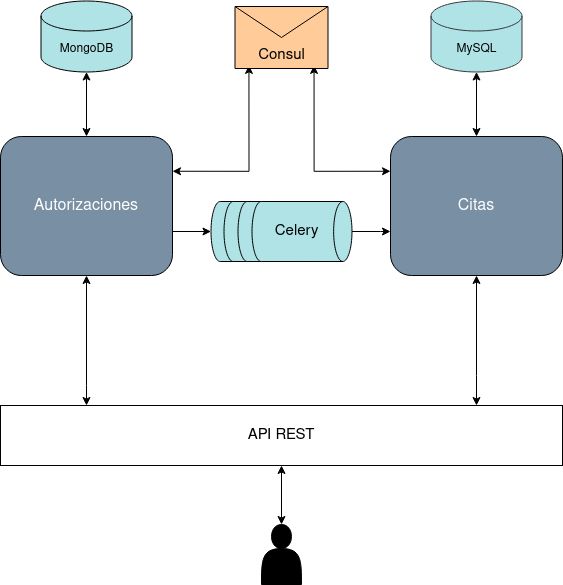

# Servicio de solicitudes de autorizaciones médicas

---

**Autor:** Carlos Morales Aguilera

**Asignatura:** Cloud Computing

**Universidad:** Universidad de Granada (UGR)

## Configuración inicial del repositorio

---

La configuración del entorno de Git y Github en mi máquina local se puede visualizar [aquí](https://github.com/Carlosma7/CC-MedAuth/blob/main/doc/config_entorno.md).

## Descripción de problema y solución del proyecto

---

La descripción detallada del problema y la solución propuesta se puede leer [aquí](https://github.com/Carlosma7/CC-MedAuth/blob/main/doc/descripcion_problema.md).

## Arquitectura

---

La arquitectura propuesta se trata de una arquitectura basada en [microservicios](https://decidesoluciones.es/arquitectura-de-microservicios), frente a una arquitectura monolítica, tras valorar las distintas características y ver [comparativas](https://www.chakray.com/es/devops-arquitectura-monolitica-vs-microservicios/). De este modo podemos realizar un despliegue en la nube ofreciendo la posibilidad de obtener un servicio compuesto de un conjunto de microservicios que funcionan de forma aislada pero a su vez se puedan comunicar entre ellos.

Al emplear esta arquitectura contaremos con ventajas como pueden ser la *escalabilidad*, *versatilidad*, *autonomía*, *mantenimiento simple* y *aislamiento de errores*. Por todos estos motivos he decidido emplear esta arquitectura frente a otras opciones.

La arquitectura propuesta estará compuesta de los siguientes microservicios:

*  **Microservicio de autorizaciones médicas**: Se encargará de toda la funcionalidad asociada a las autorizaciones de intervenciones, operaciones o pruebas de diagnóstico.
*  **Microservicio de citas médicas**: Se encargará de la visualización y notificación de citas concertadas para los pacientes.

A continuación se muestra el esquema de nuestra arquitectura: 

## Herramientas

---

##### Lenguaje de programación

El lenguaje con el que se van a desarrollar los distintos microservicios va a ser [Python](https://www.python.org/). Tras valorar otras opciones como *Node.js*, *Ruby* o *Go*, y observar algunas [comparativas](https://www.clariontech.com/blog/5-best-technologies-to-build-microservices-architecture).

La versión escogida será [Python 3.6](https://www.python.org/downloads/release/python-360/), por lo que será la versión mínima requerida, siendo compatible con las versiones superiores. De esta forma quedará establecido:

* Mínima: *Python 3.6*.
* Máxima: *Python 3.9*.

Por lo tanto, las herramientas que se escogan a continuación buscarán obtener la mayor integración natural posible con el lenguaje.

##### Framework

Se empleará como framework [Flask](https://flask.palletsprojects.com/en/1.1.x/), frente a *Django* y otros competidores, el cual nos permitirá realizar el proceso de construcción de nuestra web. Se ha escogido *Flask* debido a que se trata un framework más sencillo de desarrollar frente a *Django*, tras analizar las distintas [ventajas y desventajas](https://openwebinars.net/blog/django-vs-flask/) que ofrecen ambos.

##### Almacenamiento

El almacenamiento de datos se realizará con [MongoDB](https://www.mongodb.com/es), ya que requerirá un sistema de estructuras no fijas que permitan una gran escalabilidad. Se utilizará frente a competidores como *CouchDB* o *Redis* ya que permite que cada documento tenga su propio esquema y por su facilidad de integración con *Python* con herramientas como [PyMongo](https://pymongo.readthedocs.io/en/stable/).

##### Descubrimiento de servicios

Se utilizará [Consul](https://www.consul.io/) como sistema de descubrimiento de servicios ya que permite un registro de los servicios, es compatible con APIs basadas en *HTML* y *JSON*, utiliza un sistema de almacenamiento por pares clave-valor, y posee una documentación detallada y sencilla.

##### Gestión de eventos

Al tratarse de dos microservicios que se encuentran comunicados, se ha escogido realizar el sistema haciendo uso de una cola de eventos. Por facilidad de integración con *Python*, por documentación y por facilidad de uso se ha escogido [Celery](https://docs.celeryproject.org/en/stable/), la cual nos permite mantener una cola de eventos distribuida. Esta herramienta además se comentó en clase y tras una investigación se ha observado que puede ser útil para el proyecto.

El objetivo de esta cola será comunicar ambos microservicios de forma que:

* El microservicio de **Autorizaciones** será monitorizado de forma que si se recibe una solicitud de autorización aprobada, esta envíe un mensaje al microservicio de **Citas**.
* El microservicio de **Citas** a su vez enviará notificaciones de cuando se concierta una cita al paciente.

##### Gestor de tareas

Tras valorar las [diferencias](https://github.com/kipyin/pokemaster/issues/8) entre *Makefile* e [Invoke](http://www.pyinvoke.org/), se ha optado por *Invoke* ya que este se encuentra integrado de forma natural con *Python* y su posibilidad de utilizarse junto al debugger propio del lenguaje.

##### Gestor de versiones

Al trabajar con *Python* se ha decidido utilizar [venv](https://docs.python.org/3/library/venv.html) como gestor de las distintas versiones en las que desarrollar, ya que en versiones superiores a *Python3.3* *virtualenv* presenta problemas con los archivos binarios. Esta herramientas nos será muy útil para poder adaptar nuestro proyecto a distintas versiones y no limitarnos a la que existe por defecto en nuestro sistema operativo.
