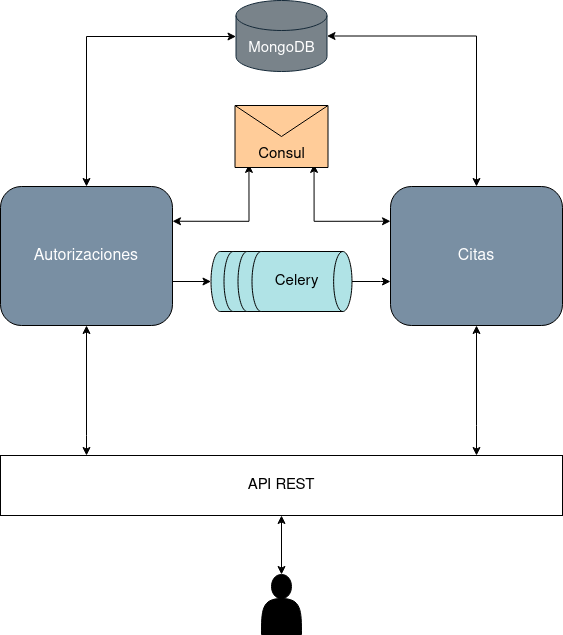

# Servicio de solicitudes de autorizaciones médicas

---

**Autor:** Carlos Morales Aguilera

**Asignatura:** Cloud Computing

**Universidad:** Universidad de Granada (UGR)

## Configuración inicial del repositorio

---

La configuración del entorno de Git y Github en mi máquina local se puede visualizar [aquí](https://github.com/Carlosma7/CC-MedAuth/blob/main/doc/config_entorno.md).

## Descripción de problema y solución del proyecto

---

La descripción detallada del problema y la solución propuesta se puede leer [aquí](https://github.com/Carlosma7/CC-MedAuth/blob/main/doc/descripcion_problema.md).

## Arquitectura

---

La arquitectura propuesta se trata de una arquitectura basada en [microservicios](https://decidesoluciones.es/arquitectura-de-microservicios), frente a una arquitectura monolítica, tras valorar las distintas características y ver [comparativas](https://www.chakray.com/es/devops-arquitectura-monolitica-vs-microservicios/). De este modo podemos realizar un despliegue en la nube ofreciendo la posibilidad de obtener un servicio compuesto de un conjunto de microservicios que funcionan de forma aislada pero a su vez se puedan comunicar entre ellos.

Al emplear esta arquitectura contaremos con ventajas como pueden ser la *escalabilidad*, *versatilidad*, *autonomía*, *mantenimiento simple* y *aislamiento de errores*. Por todos estos motivos he decidido emplear esta arquitectura frente a otras opciones.

La arquitectura propuesta estará compuesta de los siguientes microservicios:

*  **Microservicio de autorizaciones médicas**: Se encargará de toda la funcionalidad asociada a las autorizaciones de intervenciones, operaciones o pruebas de diagnóstico.
*  **Microservicio de citas médicas**: Se encargará de la visualización y notificación de citas concertadas para los pacientes.

A continuación se muestra el esquema de nuestra arquitectura: 

## Herramientas

---

* Lenguaje de programación: [Python](https://www.python.org/), concretamente la versión mínima será la [Python 3.6](https://www.python.org/downloads/release/python-360/).
* Framework REST-API: [Flask](https://flask.palletsprojects.com/en/1.1.x/).
* Almacenamiento: [MongoDB](https://www.mongodb.com/es) con la herramienta [PyMongo](https://pymongo.readthedocs.io/en/stable/).
* Descubrimiento de servicios: [Consul](https://www.consul.io/).
* Gestor de eventos: [Celery](https://docs.celeryproject.org/en/stable/).
* Gestor de tareas: [Invoke](http://www.pyinvoke.org/).
* Gestor de versiones: [venv](https://docs.python.org/3/library/venv.html).

La justificación de la elección de las herramientas propuestas se puede ver [aquí](https://github.com/Carlosma7/CC-MedAuth/blob/main/doc/justificacion_herramientas.md).
