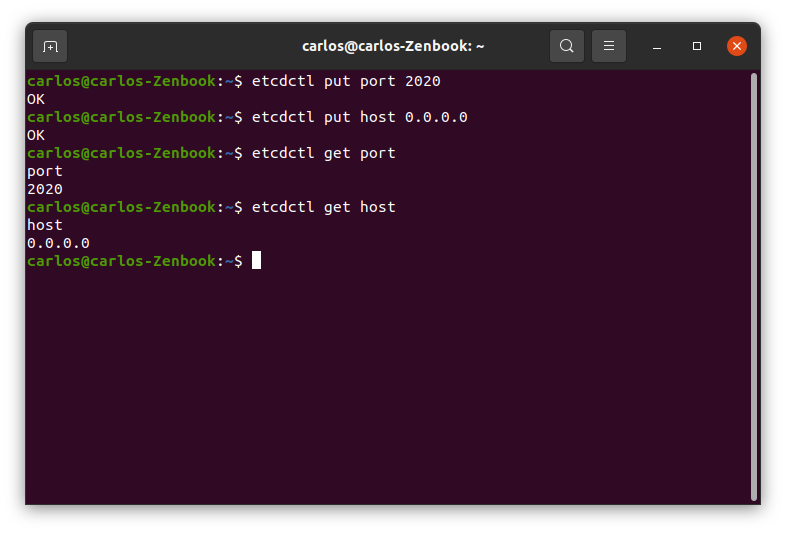

### Configuración distribuida

#### Elección de herramienta
Una de las buenas prácticas a la hora de diseñar nuestro proyecto, es la de distinguir entre la aplicación en sí y la configuración del mismo. Por ello se propone la utilización de una herramienta de configuración externa que permita definir en nuestro caso tanto el *host* como el *puerto* de las instancias de nuestro microservicio. Es importante señalar que existen numerosas herramientas y que estas aportan diferentes funcionalidades, que serán relevantes según el proyecto, pero en este caso la configuración es sencilla y no requiere de la herramienta más potente, sino una cómoda y útil.

Entre las opciones disponibles, se han estudiado las tres principales herramientas actualmente:

* [etcd](https://etcd.io/): Funciona como un almacén de *clave-valor* distribuido que proporciona una forma fiable de almacenar datos a los que debe acceder un sistema distribuido o un grupo de máquinas. Las aplicaciones de cualquier complejidad, pueden leer y escribir datos en etcd. Un caso de uso simple es almacenar los detalles de la conexión de la base de datos o los indicadores de características en etcd como pares clave-valor.
* [consul](https://www.consul.io/): Es una herramienta de **Hashicorp**, la cual facilita la comunicación entre servicios, llevando a cabo el registro y descubrimiento de los mismos. Sus características más importantes son el *Descubrimiento de servicios*, *Almacenamiento clave-valor* y *Multidatacenter*. El concepto fundamental de Consul es **Agente**. Es el responsable de ofrecer información de sí mismo y recoger información de los demás agentes.
* [Zookeeper](https://zookeeper.apache.org/): Se presenta como un servicio centralizado que mantiene la información de configuración y se encarga de una sincronización distribuida entre servicios. Todos estos servicios son utilizados de una forma u otra por aplicaciones distribuidas. Aunque se presenta como una herramienta segura y potente, se define a sí misma como una herramienta compleja y que requiere una extensa configuración.

Tras analizar las diferentes opciones, se ha optado por realizar la configuración distribuida con **etcd** y ofrecer un soporte extra con [dotenv](https://pypi.org/project/python-dotenv/).

**etcd** ofrece una configuración realmente sencilla entre servicios y es una de las herramientas más extendidas, por lo que se considera una opción más que suficiente e interesante para el proyecto.

Por otro lado, al tratarse de un proyecto que actualmente consta de un único microservicio, la configuración distribuida carece de sentido como tal, por lo que se ha optado por realizar una segunda configuración extra que respalde, haciendo uso de la metodología **.env**, almacenando las claves de *puerto* y *host* en dicho fichero, y obteniendo las claves de este fichero si se produce algún error o falta alguna información de **etcd**.

#### Configuración etcd

Un ejemplo sencillo de la configuración de *etcd* se puede encontrar [aquí](https://github.com/Carlosma7/EJERCICIOS-CC/blob/main/Ejercicios/tema5.md). Para trabajar con *etcd* se ha utilizado la libería en *Python* [etcd3](https://pypi.org/project/etcd3/).

Lo primero ha sido configurar las claves para el *puerto* y el *host*:



A continuación, se define la lógica de funcionamiento para obtener las claves desde el fichero [main](https://github.com/Carlosma7/MedAuth/blob/main/src/core/main.py):
```python
# Obtener cliente etcd
etcd = etcd3.client()
# Obtener host y puerto
server_port = etcd.get('port')[0]
server_host = etcd.get('host')[0]
# Comprobar que existen ambas claves
if server_host and server_port:
	server_host = server_host.decode('utf-8')
	server_port = server_port.decode('utf-8')
else:
	raise ValueError('No existen los valores "port" y "host"')
```

Como se puede observar, si no existe alguno de los valores se lanza una excepción y si no se realizase correctamente la conexión se lanzaría una excepción del tipo ```etcd3.exceptions.ConnectionFailedError```. Estas excepciones se controlaran para poder comprobar las claves del fichero *.env* en caso de que algo no funcionase correctamente en *etcd*.

#### Configuración .env

Para trabajar con la metodología *.env* se ha utilizado la librería *Python* [python-dotenv](https://pypi.org/project/python-dotenv/).

Lo primero es configurar las claves en el fichero, lo cual se puede observar en el fichero [.env](https://github.com/Carlosma7/MedAuth/blob/main/.env) del proyecto. Se comenta en este [issue](https://github.com/Carlosma7/MedAuth/issues/93#issuecomment-751499964) el conocimiento de que no es una buena práctica y se justifica su uso en este proyecto con fin demostrativo, documentativo y académico.

A continuación, se define la lógica del funcionamiento de *dotenv*  y el control de excepciones de *etcd*:

```python
# Si etcd no funciona
except:
	# Obtener información de .env
	load_dotenv(dotenv_path = '.env')
	# Obtener host y puerto
	server_port = os.getenv('PORT')
	server_host = os.getenv('HOST')
```

Por último, tras finalmente asegurarnos de que obtiene la información o bien mediante *etcd* o mediante *dotenv*, podemos ejecutar la aplicación del proyecto:

```python
# Se lanza la aplicación
app.run(port=server_port, host=server_host)
```

