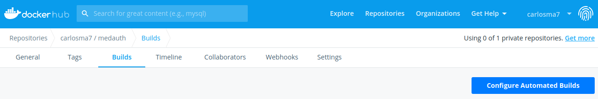
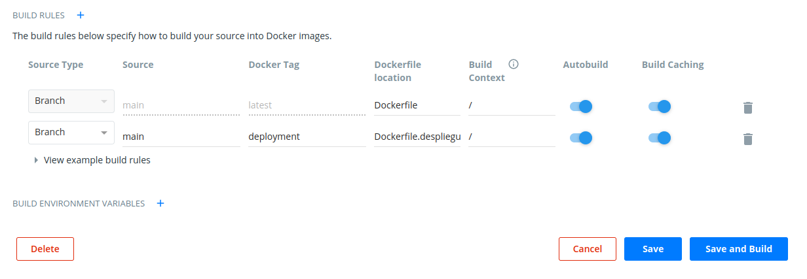
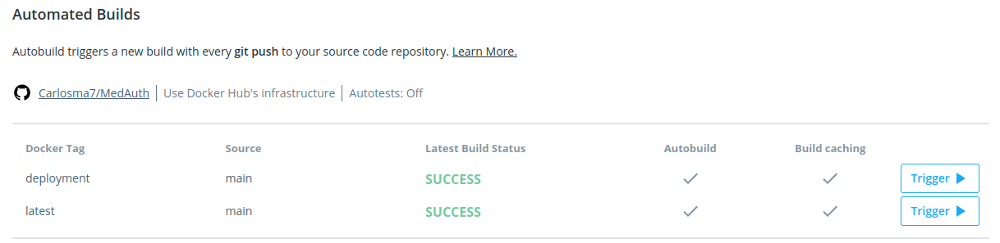

### Contenedor de despliegue

#### WSGI
Para poder desplegar el proyecto en un contenedor, se debe configurar un *Dockerfile* que permita lanzar el servidor del proyecto, pero en *Python* necesitaremos un *Web Server Gateway Interface* (WSGI) para su ejecución, por lo que se han observador algunas opciones como [gunicorn](https://gunicorn.org/), [hypercorn](https://pypi.org/project/Hypercorn/) o [uWSGI](https://uwsgi-docs.readthedocs.io/en/latest/WSGIquickstart.html), pero finalmente se ha utilizado **gunicorn** ya que la configuración necesaria es sencilla y se podría realizar con cualquiera de las herramientas propuestas.

Tras instalar *gunicorn*, lanzamos el proceso con:

```shell
gunicorn --bind 0.0.0.0:2020 --chdir ./src/core main:app
```

Para su ejecución con el gestor de tareas, se ha adaptado la tarea *execute*, ya que está pensada para este fin, de la siguiente manera en el fichero [tasks.py](https://github.com/Carlosma7/MedAuth/blob/main/tasks.py):

```python
@task
def execute(c):
	print("Ejecución de MedAuth\n")
	run("gunicorn --bind 0.0.0.0:2020 --chdir ./src/core main:app")
```

#### Contenedor Docker de despliegue

Al tratarse de *Python*, no existen realmente diferencias entre las capas del contenedor que hace de entorno de pruebas y el de despliegue, salvo la tarea a ejecutar, la cual se modifica en el [Dockerfile de despliegue](https://github.com/Carlosma7/MedAuth/blob/main/Dockerfile.despliegue):

```dockerfile
# Python 3.8-slim (Debian buster-slim based)
FROM python:3.8-slim

# Se indica mantenedor de la imagen
LABEL maintainer="Carlos Morales <carlos7ma@correo.ugr.es>"

# Se etiqueta la imagen para almacenarla en Github Container Registry
LABEL org.opencontainers.image.source https://github.com/carlosma7/medauth

# Etiquetas relativas a la imagen creada
LABEL build-date="21/10/2020"
LABEL description="Medical Authorization Project on Python3.8-slim debian based docker."
LABEL github.url="https://github.com/Carlosma7/MedAuth"
LABEL version="1.0.0"

# Se configura el PATH para ejecutar paquetes de Pip
ENV PATH=/home/medauth/.local/bin:$PATH

# Creación de usuario con permisos básicos
RUN useradd -ms /bin/bash medauth \
	&& mkdir -p app/test \
	&& chown medauth /app/test

# Se configura para utilizarse el usuario creado
USER medauth

# Se configura el directorio de trabajo
WORKDIR /app/test

# Se copia el fichero de requisitos de paquetes pip
COPY requirements.txt .

# Instalación de los requisitos y se borra el fichero tras la instalación
RUN pip install -r requirements.txt --no-warn-script-location \
	&& rm requirements.txt


# Ejecución
CMD ["invoke", "execute"]
```

#### Automatización de builds en Docker Hub

Para que se actualice el contenedor de despliegue, nos dirigiremos a *Docker Hub*, dentro del proyecto al apartado de *Builds*, y en este seleccionaremos ```Configure Automated Builds```:



A continuación nos dirigiremos al apartado ```Build rules```, seleccionaremos el botón ```+``` y añadiremos la información del nuevo *Dockerfile.despliegue*. Una vez configurado seleccionaremos ```Save and Build```:



Se puede observar que se han construido correctamente los contenedores del proyecto:



