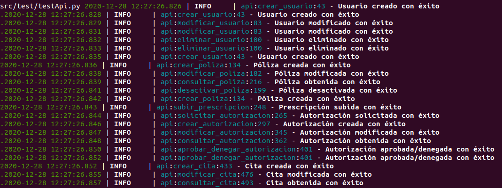

### Logs

#### Elección de herramienta
Otra de las buenas prácticas a la hora de diseñar nuestro proyecto, es la de tener un *log* o registro en el que poder ver las diferentes acciones que se realizan en nuestro sistema para poder realizar *debugs* posteriores y ver donde se producen errores y por qué se producen.

Dentro de *Python* existe una infinidad de librerías, pero tras analizar varias, finalmente se han investigado cuatro opciones que se consideran interesantes:

* [logging](https://docs.python.org/3/library/logging.html): Es la librería estándar de logs para *Python*, la cual define las funciones y clases que implementan un sistema flexible de manejo de eventos para logging en aplicaciones. La principal ventaja es que se encuentra integrada de forma nativa en *Python*.
* [loguru](https://github.com/Delgan/loguru): Es una biblioteca cuyo fin es facilitar la implementación de un sistema de logging, de la forma más cómoda y agradable. Se presenta como una alternativa potente a la par que sencilla y competidora de otras herramientas más clásicas como *logging*.
* [daiquiri](https://github.com/jd/daiquiri): Consiste en una librería que trabaja sobre *logging* y que facilita la configuración del mismo, por lo que resulta una herramienta interesante si se pretende trabajar con la librería estándar para facilitar su configuración.
* [logzero](https://github.com/metachris/logzero): Es otra librería que se presenta como una herramienta para diseño de un sistema de logging sencillo. Trabaja con su propio *logger* y es compatible con formato *JSON*.

Aunque resulta interesante la opción de trabajar con *logging* haciendo uso de *daiquiri* para su configuración, las otras dos opciones existentes se presentan como unas grandes alternativas, por lo que es preferibles trabajar únicamente sobre una herramienta que realiza todo el sistema de logging de forma sencilla.

Aunque ambas opciones son considerablemente buenas, finalmente se ha optado por **loguru** ya que su uso está más extendido y su última versión es más reciente que la de su alternativa (a día 28 de diciembre de 2020). Además, las funcionalidades que ofrece **loguru** son más extensas por lo que si se requiriera una ampliación del sistema, sería interesante disponer de un mayor abanico de posibilidades.

#### Configuración loguru

Lo principal a la hora de trabajar con **loguru** es definir el objeto *logger*, el cual se encarga de la gestión del log, para ello basta con importarlo de la misma librería, y si fuera necesario configurar los parámetros necesarios, en este caso al ser un proyecto sencillo, con la configuración predeterminada es más que suficiente.

El principal motivo por el que se ha escogido **loguru** es por la sencillez que esta herramienta proporciona, por ejemplo, posee las siguientes instrucciones:

```python
# Log info
logger.info('Texto informativo')
# Log debug
logger.debug('Texto debug')
# Log warning
logger.warning('Texto warning')
# Log error
logger.error('Texto error')
```
Una vez comprendida la facilidad de la configuración de un sistema de logs con *loguru*, se procede a mostrar un ejemplo de los logs implementados en la API:

```python
try:
	# Creación usuario
	controlador.crear_usuario(usuario, tipo)
except ValueError as error:
	# Se transmite el error mediante el log
	logger.error(error)
	# Se produce un error
	return str(error), 400

# Se transmite el estado de éxito mediante el log	
logger.info('Usuario creado con éxito')
# Estado de éxito
return 'Usuario creado con éxito.', 201
```

Se puede ver que funcionan correctamente los logs:


