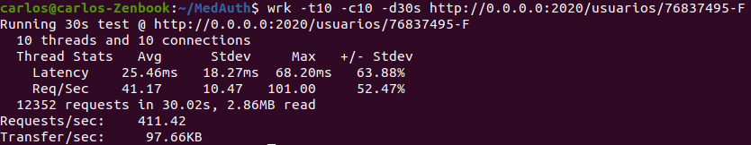
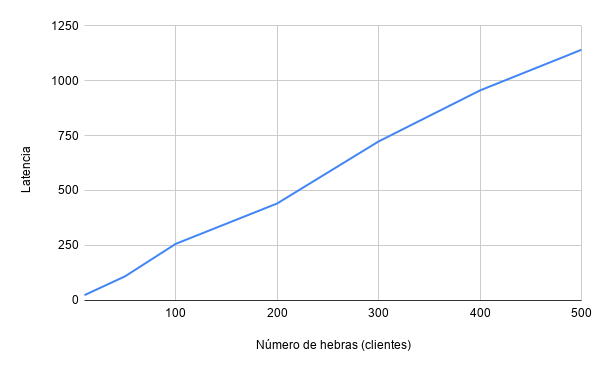
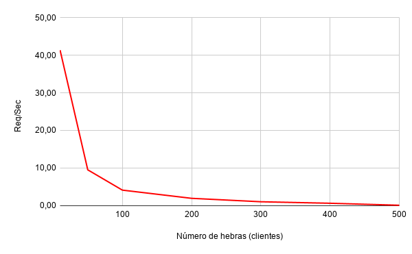
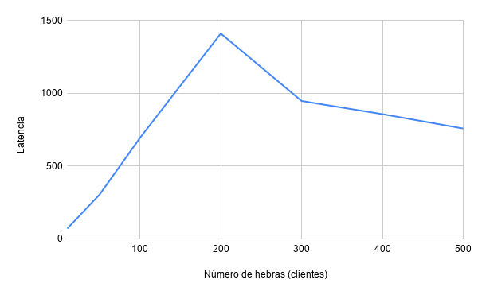
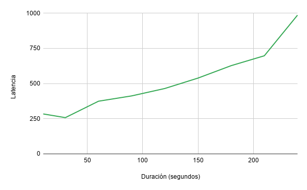
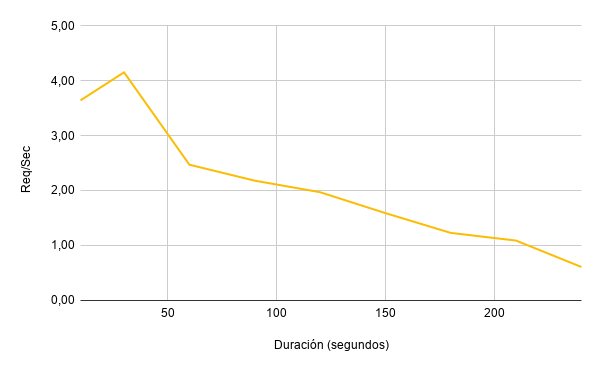

### Benchmarks

Las pruebas de rendimiento permiten medir el rendimiento y el comportamiento de nuestra API y ver como esta responde a diferentes cargas de trabajo con el objetivo de comprobar que el proyecto es fiable frente a grandes cargas de usuarios o fuertes periodos de trabajo mediante pruebas de esfuerzo.

#### WRK

Para la realización de las pruebas de rendimiento se utilizará la herramienta [wrk](https://github.com/wg/wrk), la cual permite una sencilla configuración de pruebas de rendimiento, lanzando diferentes hebras y permitiendo configurar el número de configuraciones máximas o la duración de las pruebas de esfuerzo.

Un ejemplo de configuración de *wrk* sería:

```shell
wrk -t<num_hebras> -c<num_max_conex> -d<duracion> <url>
```

Para las pruebas, se ha decidido crear un usuario y realizar peticiones de consulta sobre usuario, haciendo uso del URI correspondiente, por lo tanto, un ejemplo para 10 clientes, 10 conexiones máximas y 30 segundos de duración, sobre el URI ```http://0.0.0.0:2020/usuarios/76837495-F``` sería:

```shell
wrk -t10 -c10 -d30s http://0.0.0.0:2020/usuarios/76837495-F
```

Y se vería de la siguiente forma:



#### Resultados obtenidos

Con el fin de obtener unos resultados más fiables, se han realizado diferentes pruebas considerando diferentes números de hebras (clientes) y diferentes periodos de duración para someter a diferentes pruebas de esfuerzo la API, por lo que se podrá observar en las siguientes gráficas que se analizarán.

##### Crecimiento del número de hebras (duración 30s)

En este caso se ha considerado un mismo periodo de duración de 30s para todas las pruebas, pero sometiendo a diferentes números de clientes simultáneos.

Primero se evalúa la latencia de la API:



Y posteriormente se observa el número de peticiones procesadas por segundo:



##### Crecimiento del número de hebras (duración 60s)

En este caso se repite el mismo caso que en el anterior, con la diferencia de que los periodos de duración serán de 60s para todas las pruebas.

Primero se evalúa la latencia de la API:



Y posteriormente se observa el número de peticiones procesadas por segundo:


##### Crecimiento del periodo de duración (100 hebras simultáneas)

En este caso para un total de 100 hebras se irán variando los periodos de duración para someter a diferentes pruebas de esfuerzo.

Primero se evalúa la latencia de la API:



Y posteriormente se observa el número de peticiones procesadas por segundo:



#### Conclusiones finales

Tras analizar los diferentes resultados se han observado ciertos factores:

* El servidor es resistente a altos números de usuarios simultáneos, de hecho no se pierden paquetes para pruebas de 30s hasta que se enfrenta a una cantidad de 500 hebras (173 paquetes), lo cual es un rendimiento más que aceptable. Para pruebas de 60s, a partir de 300 hebras (7500 paquetes) se obtiene un rendimiento más bajo como cabe esperar, pero es un caso más específico de alta carga.
* Se puede observar en las gráficas que a medida que crece el número de clientes, la latencia crece rápidamente y se procesan menos peticiones por segundo, como es lógico. En la gráfica de los 60s se puede apreciar que a partir de los 200 clientes, se reduce la latencia, pero esto se debe a que el número de paquetes procesados es menor.
* Para un número de 100 hebras simultáneas, el servidor obtiene buenas resultados con un número aceptable de peticiones por segundo para altos periodos de esfuerzo, llegando incluso a los 4 minutos obteniendo más de una petición por segundo.

