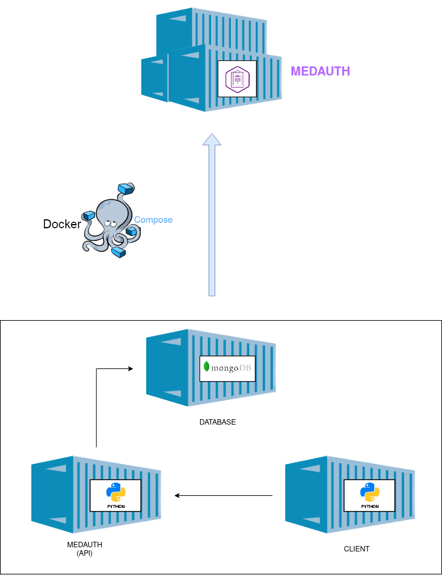

### Clúster

#### Planteamiento

Como en cualquier empresa de seguros de salud, la información debe almacenarse en una base de datos que permita la persistencia de los datos y la escalabilidad de un sistema de gestión de la información de los usuarios, pólizas y demás entidades que intervienen en el *landscape* del proyecto. Además, como se trata de un proyecto cloud, no es una opción lógica realizar un almacenamiento local dentro de la misma lógica de negocio o en contenedores locales, por lo que una de las principales necesidades del proyecto en el punto actual es utilizar una BD no relacional que permita almacenar la información de las entidades ya mencionadas. Se escogerá una BD no relacional por los siguientes motivos:

* Se necesita representar los datos mediante agrupaciones, y la representación de los mismos es variable en el tiempo, debido al rápido cambio que existe dentro del sector médico.
* Se debe permitir la colaboración de una gran cantidad de equipos
* Se necesita que escale a altos niveles de tráfico de lectura y escritura, ya que el escenario contempla accesos tantos de clientes como de administrativos propios de las empresas.
* Se debe trabajar con un conjunto de datos a un tamaño masivo, el cual se contempla en el escenario propuesto.
* Es un escenario bastante cambiante, por lo que la lógica de negocio se puede ver afectada.

Por otro lado, esta información no debe almacenarse únicamente de forma local, por lo que al tratarse de un proyecto cloud, lo ideal sería realizar la composición del contenedor de la API del proyecto y un contenedor de una BD con las características descritas previamente.

Por último, al tratarse de un proyecto cloud, se ha considerado oportuno e interesante la inclusión de un cliente, el cual se pueda contener en un contenedor y realizar la composición con los dos contenedores previamente indicados.

#### Elección de una BD

Dentro de la elección de un sistema de gestión de BD no relacional o NoSQL, existen diferentes alternativas, entre las cuales se evaluarán tres de las más populares:

* [MongoDB](https://www.mongodb.com/es): Utiliza una base de datos con un modelo orientado a documentos que soporta diferentes formatos de datos. Se utiliza principalmente en aplicaciones cuyos datos poseen formatos no estructurados, y en lugar de tablas y filas, utiliza colecciones y documentos. Se trata de un sistema muy rápido y escalable. Entre llas principales ventajas se pueden encontrar:
	* Almacenamiento de datos no estructurados.
	* Fácilmente actualizable y escalable.
	* Útil para datos con formato variable.
	* Alta tasa de inserción para situaciones con cargas de escritura altas.

* [CouchDB](https://couchdb.apache.org/): Es un sistema de base de datos NoSQL de código abierto desarrollada por Apache. Los datos se almacenan siguiendo un formato JSON y se organizan en pares clave-valor (similar al MapReduce). Esta herramienta está diseñada para ofrecer accesibilidad web que admite una variedad de dispositivos. 
	* Proporciona interacción con servidores proxy HTTP, balanceadores de carga u otras herramientas externas.
	* Un clúster de múltiples nodos permite guardar datos de forma eficiente y redundante. Por otro lado se puede ejecutar un único servidor de base de datos lógico.
	* Soporte de autenticación que garantiza la seguridad.
* [Cassandra](https://cassandra.apache.org/): También es un sistema de base de datos NoSQL que pertenece a Apache. Se considera una de las principales alternativas a MongoDB y ofrece soporte de replicación de datos en diferentes centros de datos. Es una de las principales opciones a considerar si se requiere escalabilidad y alta disponibilidad, sin que esta afecte al rendimiento, además de brindar seguridad y durabilidad.
	* Soporta integración con servicios de terceros.
	* Réplica de datos en diferentes nodos para ofrecer tolerancia a fallos, evitando cuellos de botella en la red.
	* Permite elegir entre replicación síncrona o asíncrona de los datos.

Tras evaluar diferentes implementaciones de los tres sistemas, finalmente se ha decidido utilizar **MongoDB** como sistema de gestión de la BD del proyecto, ya que brinda una integración más sencilla y en este punto del proyecto se conoce una estructura de los datos que podría variar en un futuro, y la utilización de un almacenamiento mediante colecciones y documentos resulta ideal para este caso.

#### Cluster final

Por lo tanto se obtendría una clúster con la siguiente composición:

