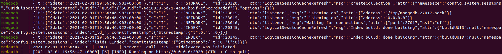
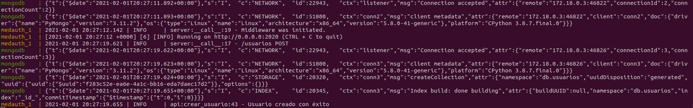

### Composición

#### Definicion de la composición
Tal y como se ha visto en la documentación sobre el [cluster](https://github.com/Carlosma7/MedAuth/blob/main/doc/composicion/cluster.md) propuesto, como en la documentación de los [contenedores propuestos](https://github.com/Carlosma7/MedAuth/blob/main/doc/composicion/contenedores.md) existe una composición de tres contenedores que contienen la API, la BD y el cliente del proyecto, por lo que para realizar la composición y comunicaciones entre ellos, se deben considerar los siguientes aspectos:

* Definir una red de conexión que actúe como *bridge* entre los diferentes contenedores.
* Comunicar el contenedor de la API con el contenedor de *MongoDB* a través del puerto destinado para ello (27017) utilizando el host apropiado y la base de datos (*medauthdb*), todo esto mediante variables de entorno definidas en el contenedor de la API.
* Comunicar el contenedor del cliente con el contenedor de la API, a través del puerto destinado para ello (2020) utilizando el host apropiado, todo esto mediante variables de entorno definidas en el contenedor del cliente.
* Permitir la ejecución en fondo del contenedor del cliente para poder hacer uso de este.
* Indicar las diferentes de dependencias entre los contenedores.
* Tal y como se indicó, obtener la [imagen oficial de *MongoDB* en *Docker Hub*](https://hub.docker.com/_/mongo) y configurar la base de datos (*medauthdb*).

Por lo tanto, para la realización de la composición se ha utilizado la herramienta *Docker-compose*, el cual permite definir las diferentes restricciones mencionadas previamente. Para ello se ha definido la siguiente composición en el fichero [docker-compose.yml](https://github.com/Carlosma7/MedAuth/blob/main/docker-compose.yml):

```YAML
version: '3'

networks:
  app-tier:
    driver: bridge

services:
  mongodb:
    image: mongo:4.4.2
    container_name: mongodb
    restart: unless-stopped
    environment:
      MONGO_INITDB_DATABASE: medauthdb
      MONGODB_DATA_DIR: /data/db
      MONDODB_LOG_DIR: /dev/null
    ports:
      - 27017:27017
    networks:
      - app-tier
  
  medauth:
    build:
      context: .
      dockerfile: Dockerfile.despliegue
    ports:
      - 2020:2020
    environment:
      MONGODB_DATABASE: medauthdb
      MONGODB_HOSTNAME: mongodb
      MONGODB_PORT: 27017
    depends_on:
      - mongodb
    networks:
      - app-tier

  client:
    build:
      context: .
      dockerfile: Dockerfile.cliente
    environment:
      MEDAUTH_HOSTNAME: medauth
      MEDAUTH_PORT: 2020
    stdin_open: true
    depends_on:
      - medauth
    networks:
      - app-tier

```

#### Ejecución

Por lo tanto, al realizarse la ejecución del contenedor, se puede ver el resultado correctamente de la siguiente forma:



Y al realizar una petición desde el cliente, se puede ver que se recibe la petición, se trata en la API y se opera de con la BD de *MongoDB*:



