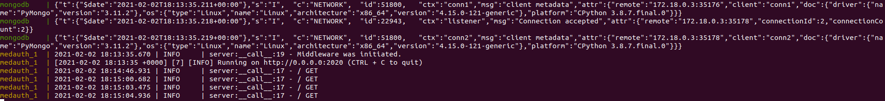

### Despliegue

#### Servicio de despliegue

Para la realización del despliegue del proyecto, se ha optado por utilizar un *IaaS* (Infraestructure as a Service), el cual nos ofrecerá una infraestructura (máquina virtual) sobre la que desplegar el proyecto y ejecutar nuestro servidor de forma que se pueda acceder a este desde cualquier lugar.

Dentro de los servicios de *IaaS* existen diferentes opciones, pero aprovechando las condiciones de la oferta de *GitHub Education*, que ofrece créditos para **Digital Ocean**, se ha decidido aprovechar esta ventaja y desplegar el proyecto utilizando un *droplet* de la misma.


Una vez aceptada la oferta, nos dirigimos a la página oficial de *Digital Ocean* donde nos registramos con la cuenta de *GitHub* y tras aceptar los términos y canjear el código de promoción nos dirigiremos al proyecto inicial.


Una vez aquí seleccionaremos el botón ```Get Started with a Droplet``` para definir nuestra primera máquina virtual. Una vez empezamos a definir nuestra instancia seguimos los siguientes pasos:

1. Escoger una imagen y plan para nuestra instancia. En este caso basta con un plan básico, y tras informarnos un poco se decide escoger una imagen de *Ubuntu 18.04* ya que la distro *20.04* ha reportado determinados problemas con *docker-compose*.

	

2. Escoger plan de pago, en este caso bastará con el más básico.

	

3. Escoger una region, preferiblemente cercana a nuestra ubicación real, para tener una menor latencia, por lo que se ha escogido *Frankfurt (Alemania)*.

	

4. Escoger un sistema de autenticación, en este caso con una contraseña será suficiente para realizar las conexiones.

	

5. Por último, crearemos la instancia y esperamos a que esta se construya.

Una vez construida la instancia, podemos observar esta dentro de nuestro proyecto:


#### Despliegue del proyecto

Una vez se obtiene la instancia, se accede a ella mediante ssh con la orden ```ssh root@165.22.83.184``` accediendo con la contraseña definida.


Una vez dentro, con el siguiente script de [bash](https://github.com/Carlosma7/MedAuth/blob/main/provisionamiento.sh), realizamos la gestión de la configuración:

```shell
# Update apt packages
sudo apt-get update

# Get GPG and add key of Docker
curl -fsSL https://download.docker.com/linux/ubuntu/gpg | apt-key add -

# Add Docker repository and update packages
add-apt-repository "deb [arch=amd64] https://download.docker.com/linux/ubuntu $(lsb_release -cs) stable" && apt update

# Install Docker
sudo apt-get install -y docker-ce

# Add root user to docker group
gpasswd -a root docker

# Install Docker-compose
wget https://github.com/docker/compose/releases/download/1.28.2/docker-compose-Linux-x86_64 -O /usr/local/bin/docker-compose && chmod u+x /usr/local/bin/docker-compose

# Clone GitHub MedAuth repository
git clone https://github.com/Carlosma7/MedAuth.git

# Build project as daemon
docker-compose up -d
```

Una vez lanzado, podemos ver que se han instalado las configuraciones, por ejemplo, ejecutando el *hello world* de *Docker*:


Para comprobar que efectivamente se está ejecutando la API del proyecto, podemos realizar una sencilla petición GET a un usuario, en este caso sin que aún exista sólo para comprobar que responde:



A continuación comprobamos que si lanzamos una petición con *Postman*, esta se procesa adecuadamente:


Y vemos su respuesta en el servidor:


A continuación lanzamos otra petición mediante *Postman*, un GET para obtener el usuario creado:


