### Tests

#### Planteamiento de las pruebas

Como producto que es, para la realización de las pruebas se han de considerar las diferentes historias de usuario definidas durante la realización del proyecto, poniendo en prueba casos prácticos basados en un escenario lo más parecido a una situación real. 

Por lo tanto, el primer paso será el de indicar las *HUs* definidas en el proyecto:

* [[HU1] Crear usuario administrativo](https://github.com/Carlosma7/MedAuth/issues/43)
* [[HU2] Crear usuario asegurado](https://github.com/Carlosma7/MedAuth/issues/44)
* [[HU3] Administrar usuario](https://github.com/Carlosma7/MedAuth/issues/55)
* [[HU4] Administrar póliza de un asegurado](https://github.com/Carlosma7/MedAuth/issues/35)
* [[HU5] Consultar póliza de un asegurado](https://github.com/Carlosma7/MedAuth/issues/34)
* [[HU6] Añadir prescripción médica](https://github.com/Carlosma7/MedAuth/issues/36)
* [[HU7] Solicitar una autorización médica](https://github.com/Carlosma7/MedAuth/issues/37)
* [[HU8] Administrar autorización médica](https://github.com/Carlosma7/MedAuth/issues/39)
* [[HU9] Consultar autorización médica](https://github.com/Carlosma7/MedAuth/issues/38)
* [[HU10] Aprobar/Denegar autorización médica](https://github.com/Carlosma7/MedAuth/issues/40)
* [[HU11] Administrar cita médica](https://github.com/Carlosma7/MedAuth/issues/49)
* [[HU12] Consultar una cita médica](https://github.com/Carlosma7/MedAuth/issues/41)
* [[HU14] Consultar usuario](https://github.com/Carlosma7/MedAuth/issues/96)

Una vez definidas las *HUs* a comprobar, se definen entonces los tests que se han de realizar:

1. Crear usuario administrativo.
2. Crear usuario cliente.
3. Modificar usuario.
4. Consultar usuario.
5. Eliminar usuario.
6. Crear póliza.
7. Modificar póliza.
8. Consultar póliza.
9. Desactivar póliza.
10. Subir prescripción.
11. Solicitar autorización.
12. Crear autorización.
13. Modificar autorización.
14. Consultar autorización.
15. Aprobar/Denegar autorización.
16. Crear cita.
17. Modificar cita.
18. Consultar cita.

Por lo tanto se procede a continuación, a realizar le proceso completo de tests sobre el proyecto. Para lanzar los tests, accederemos al contenedor del cliente ejecutando ```docker-compose exec client sh```.

#### 1. Crear usuario administrativo

El primer caso consiste en la creación de un usuario administrativo, para ello consideraremos el siguiente caso:

```markdown
Nombre: Juan.
Email Personal: juan@gmail.com.
DNI: 74848392-Z.
```

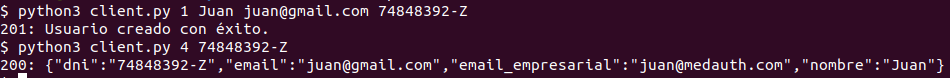

#### 2. Crear usuario cliente

En este caso se define un usuario cliente, de forma similar al punto anterior se define el siguiente caso:

```
Nombre: Carlos.
Email Personal: carlos7ma@gmail.com
DNI: 76837495-F.
Cuenta bancaria: ES1234111892738495273840.
```


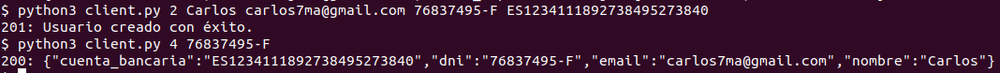

#### 3. Modificar usuario

Para este caso, tomaremos el ejemplo previo de Carlos, pero modificando la siguiente información:

```
Email Personal: carlos@correo.ugr.es
```


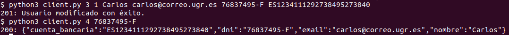

#### 4. Consultar usuario

Aunque se ha realizado en los casos anteriores, nuevamente consultamos al usuario Carlos.

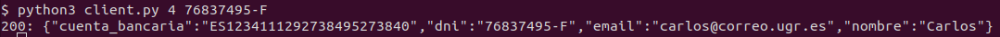

#### 5. Eliminar usuario

Para poder eliminar un usuario real, utilizaremos el usuario Juan previamente definido:


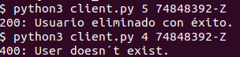

#### 6. Crear Póliza

Para este caso, utilizaremos nuevamente el usuario Carlos con una póliza con la siguiente información:

```
Usuario: Carlos. (DNI: 76837495-F).
Periodo de carencia: 03/27/2021.
Tipo de Póliza: Básica (Código: 1).
Copagos: 10.99€.
Mensualidad: 50.00€.
Servicios excluidos: Endodoncia y PCR.
Modulos Extra: Dental y Estética (Códigos: 1 y 4).
```

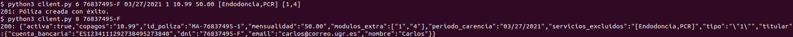

#### 7. Modificar Póliza

A continuación suponemos que el usuario hubiera decidido optar por otro tipo de póliza, de cobertura total, por lo que la información sería la siguiente:

```
Usuario: Carlos. (DNI: 76837495-F).
Periodo de carencia: 03/27/2021.
Tipo de Póliza: Total (Código: 2).
Copagos: 4.99€.
Mensualidad: 80.00€.
Servicios excluidos: Ninguna.
Modulos Extra: Dental y Estética (Códigos: 1 y 4).
```


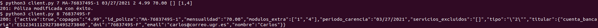

#### 8. Consultar Póliza

Para este caso consideramos la póliza definida previamente para el cliente Carlos:

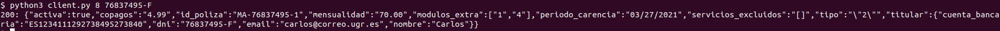

#### 9. Desactivar Póliza

A continuación suponemos que el usuario Carlos desea darse de baja del servicio, para ello indica que quiere desactivar su póliza:


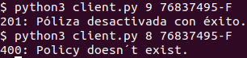

#### 10. Subir prescripción

Suponiendo que no se hubiera dado de baja el cliente y siguiera con su póliza activa, se define el caso en el que quiere subir una prescripción médica para poder posteriormente solicitar una autorización (se va a introducir un error lógico, ya que la especialidad no coincidirá con los servicios solicitados, que se tratará en uno de los puntos siguientes):

```
Usuario: Carlos. (DNI: 76837495-F).
ID Póliza: MA-76837495-1.
Fecha de realización: 05/27/2021.
Especialidad: Anestesiología (Código: 2).
Facultativo prescriptor: D.Miguel.
Facultativo realizador: D.Fernando.
Servicios solicitados: Serología.
Consulta: Consulta 3.
```

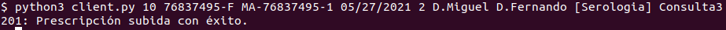

Para poder comprobar que se ha realizado correctamente, en el siguiente punto solicitaremos una autorización sobre la prescripción recién creada.

#### 11. Solicitar autorización

Para solicitar la autorización, se indica la prescripción subida previamente en el paso anterior mediante su indicador:

```
ID prescripción: PR-76837495-1
```


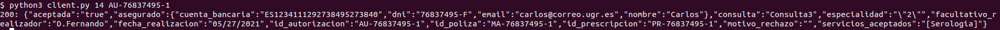

#### 12. Crear autorización

Suponemos ahora que se quiere realizar una autorización de forma manual por algún empleado, entonces se define el siguiente caso:

```
Usuario: Carlos. (DNI: 76837495-F).
ID Póliza: MA-76837495-1.
Estado: Aceptada.
Motivo de rechazo: Ninguno.
Fecha de realización: 09/27/2021.
Especialidad: Gastroenterología (Código: 7).
Facultativo realizador: D.Fernando.
Servicios solicitados: Gastroscopia.
Consulta: Consulta 3.
```

Para comprobar que se ha creado correctamente consultamos con su identificador ```AU-76837495-2```:

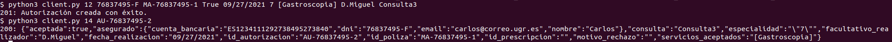

#### 13. Modificar autorización

Para realizar la modificación volvemos al caso previo de la solicitud de una Serología por parte del usuario Carlos, ya que la categoría indicada no corresponde con la que debería realmente ser, por lo que se define el caso:

```
ID Autorización: AU-76837495-1.
ID Póliza: MA-76837495-1.
Fecha de realización: 05/27/2021.
Especialidad: Epidemiologia (Código: 6).
Facultativo realizador: D.Fernando.
Servicios solicitados: Serología.
Consulta: Consulta 3.
```

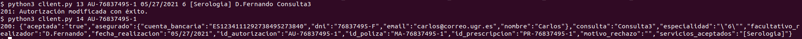

#### 14. Consultar autorización

En este caso, al disponer de dos autorizaciones distintas, se procede a observar cada una de ellas, primero la que posee el identificador ```AU-76837495-1```:

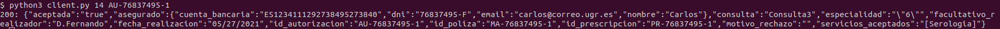

Y posteriormente la que posee el identificador ```AU-76837495-2```:

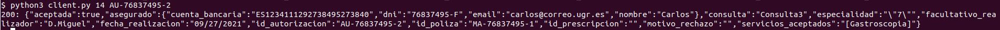

#### 15. Aprobar/Denegar autorización

Suponemos ahora el caso en el que por motivos de poseer el COVID-19 tras la prueba serológica, no se puede realizar la prueba de la gastroscopia, por lo que se deniega esta autorización:

```
Estado: Rechazada.
Motivo rechazo: Covid-19.
```

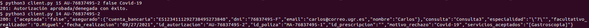

#### 16. Crear cita

Para la creación de la cita, se ha de poseer una autorización aceptada, por lo que consideraremos la autorización de la serología, en el siguiente caso:

```
ID Autorización: AU-76837495-1
Usuario: Carlos. (DNI: 76837495-F).
Fecha: 05/27/2021.
Hora: 20:15.
Facultativo realizador: D.Fernando.
Consulta: Consulta 3.
```

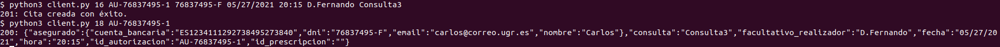

#### 17. Modificar cita

Suponemos el caso en que la hora no le viene bien al cliente, y que pide un cambio a las 18:00, entonces se define el caso:

```
ID Autorización: AU-76837495-1
Fecha: 05/27/2021.
Hora: 18:00.
Facultativo realizador: D.Fernando.
Consulta: Consulta 3.
```

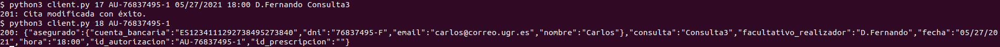

#### 18.  Consultar cita

Para este caso consideramos la cita concertada previamente para el cliente Carlos:

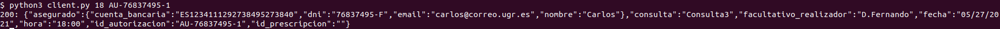

