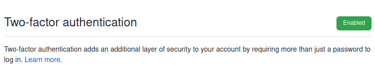
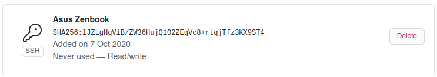
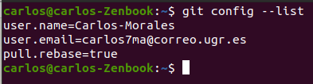
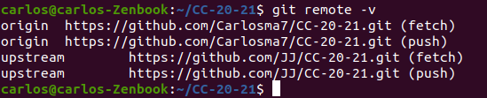
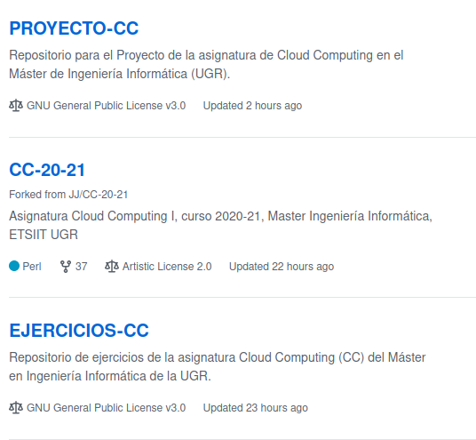

# Configuración entorno del proyecto

---

### Datos del perfil

---

Inicialmente, he completado la información de mi usuario de github para poder identificarme correctamente, incluyendo la información referente a mi ciudad, universidad, foto y nombre completo del perfil.

### Doble autenticación del perfil

---

Desde los ajustes de *GitHub*, también he accedodo a *Account security* para activar el segundo factor de autenticación. Esto permite incrementar la seguridad de la cuenta, solicitando una segunda clave que se manda en un *sms* a mi teléfono móvil cada vez que inicio sesión en *GitHub* desde un nuevo dispositivo.

### Generación de par de claves pública/privada

---

Para poder realizar la configuración del par de claves con el objetivo de utilizar conexiones SSH, he seguido la [documentación oficial de **Github**](https://docs.github.com/es/free-pro-team@latest/github/authenticating-to-github/generating-a-new-ssh-key-and-adding-it-to-the-ssh-agent), siguiendo los pasos:

1. Generar la clave SSH

    `ssh-keygen -t rsa -b 4096 -C "carlos7ma@correo.ugr.es"`

2. Copiar la clave pública

    `cat ~/.ssh/id_rsa.pub`

3. Acceder a *Settings* en **Github** e introducir la clave pública en la opción *SSH*.

### Configuración de entorno de git local

---

1. Establecer nombre de usuario y email en el entorno local.

    `git config --global user.name "Carlos-Morales"`

    `git config --global user.email "carlos7ma@correo.ugr.es"`

2. Configurar el *git pull* para que realice siempre *rebase*.

    `git config --global pull.rebase true`

3. Comprobar las modificaciones realizadas con *git config --list*.

### Clonación del repositorio del profesor

---

Para realizar la clonación el clonar el repositorio del profesor con un *fork*, desde el repositorio [*CC-20-21*](https://github.com/JJ/CC-20-21).

`git remote add upstream git@github.com:JJ/CC-20-21.git`

A continuación, actualizaremos con:

`git pull upstream master --rebase`

Se puede comprobar con `git remote -v`:

### Repositorios de la asignatura

A continuación se muestran los repositorios de la asignatura correctamente configurados:

