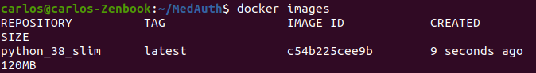

## Dockerhub

---

Para contenerizar el proyecto se utilizará el servicio de host de repositorios [Docker Hub](https://hub.docker.com/). Para ello hay que darse de alta como usuario y crear el repositorio, y a continuación sincronizar de forma automática los *build* de la imagen al actualizar la información en el repositorio de *github*.

### Subir el contenedor

Para poder realizar una subida de la imagen creada a *Docker Hub*, primero se ha creado el [repositorio](https://hub.docker.com/r/carlosma7/medauth). A continuación, se ha seguido este [tutorial](https://ropenscilabs.github.io/r-docker-tutorial/04-Dockerhub.html) para realizar la primera subida del proyecto, distinguiéndola con el tag [firsttry](https://hub.docker.com/layers/carlosma7/medauth/firsttry/images/sha256-ed008bded4ee57521e3b1f8b381ec8dbba52ce13728eb16e21037d497c3f8050) (esta imagen es previa a las optimizaciones y buenas prácticas, por ese motivo se etiquetó de forma separada para este ejemplo, no se usa).

Para poder subir el contenedor, se han seguido los siguientes pasos:

1. Se ha logueado el usuario con la orden ```docker login --username=carlosma7```.


2. Se ha creado la imagen y se comprueba con ```docker images```.


3. Se etiqueta la imagen con el tag deseado de subida, en este caso, *carlosma7/medauth:firsttry*.

4. Push de la imagen al repositorio creado con ```docker push carlosma7/medauth:firsttry```.


Este mismo proceso se ha seguido a la hora de crear la versión actual del proyecto, etiquetada como **latest**.

