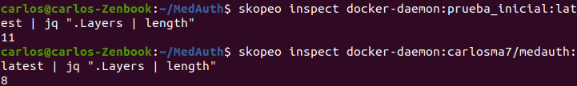

## Imagen del proyecto

---

Para la creación de la imagen, tras realizar el [estudio](https://carlosma7.github.io/MedAuth/doc/estudio_docker/estudio_contenedor_base) sobre el contenedor base, y escoger **python:3.8-slim**, se deben analizar los distintos requisitos que exige el proyecto para la ejecución del mismo.

El objetivo es poder ejecutar nuestro contenedor como un entorno de desarrollo y test, indicándole como parámetro en la creación el directorio local y el directorio donde se debe montar en nuestro contenedor el directorio con la información del proyecto. Un ejemplo propuesto de ejecución de la imagen es:

docker run -t -v `pwd`:/app/test nick-estudiante/nombre-del-repo

Comprendiendo la sintaxis de docker run -v, se entiende que sigue la forma <directorio_local>:<directorio_contenedor>, por lo que se pretende crear un directorio con la información del directorio local en la carpeta */app/test*, y ejecutar los test. No es necesario copiar NADA en la imagen, solo realizar las instalaciones de dependencias, crear el usuario y ubicarse en el directorio de trabajo */app/test*.

Una vez definida la descripción, procedemos a identificar los requisitos necesarios para la creación de la imagen:

* Contenedor base **python:3.8-slim**.
* Crear un usuario con los permisos básicos.
* Crear el esquema de directorios */app/test*.
* Dar permisos al usuario creado en el directorio creado.
* Copiar el fichero de requisitos, que contiene indicaciones de las bibliotecas y paquetes necesarios para el proyecto (*invoke*, *pytest* y *assertpy*).
* Eliminar el fichero una vez realizada la instalación (optimización).
* Configuración de variables de entorno necesarias.
* Ejecutar los tests.

Cumpliendo los distintos requisitos impuestos, se alcanza una primera versión de la forma:

```dockerfile
# Python 3.8-slim (Debian buster-slim based)
FROM python:3.8-slim

# Se indica mantenedor de la imagen
MAINTAINER Carlos Morales <carlos7ma@correo.ugr.es>

# Creación de usuario con permisos básicos
RUN useradd -ms /bin/bash medauth

# Creación del esquema de directorios
RUN mkdir -p app/test

# Asignación de permisos al usuario sobre el directorio de test
RUN chown medauth /app/test

# Se configura para utilizarse el usuario creado
USER medauth

# Se configura el directorio de trabajo
WORKDIR /app/test

# Se copia el fichero de requisitos de paquetes pip
COPY requirements.txt .

# Instalación de los requisitos y se borra el fichero tras la instalación
RUN pip install -r requirements.txt --no-warn-script-location

RUN rm requirements.txt


# Se configura el PATH para ejecutar paquetes de Pip
ENV PATH=/home/medauth/.local/bin:$PATH

# Ejecución
CMD ["invoke", "tests"]
```

Aunque esta versión cumple con los requisitos propuestos y hace uso de la mayoría de las [buenas prácticas](https://www.docker.com/blog/intro-guide-to-dockerfile-best-practices/), no es una versión optimizada, y tampoco utilizar todas las buenas prácticas, por lo que se debe tener en cuenta:

* Se respeta el orden de las instrucciones/capas. :heavy_check_mark:
* Se deben hacer copias específicas y limitadas. (Durante el proceso se planteo utilizar un fichero [.dockerignore](https://github.com/Carlosma7/MedAuth/blob/9fd88e66b74de76d122aff1f966bcd666a375004/.dockerignore), pero en este caso carece de sentido ya que se monta el directorio como parámetro). :heavy_check_mark:
* Identificar las capas y reducir el número de capas, agrupando operaciones que se pueden realizar en una misma capa. :x:
* Utilizar una imagen oficial. :heavy_check_mark:
* Utilizar tag específica. :heavy_check_mark:
* Obtener versiones minimales. (En este caso se cumple, pero no por este motivo, sino por ser la mejor opción encontrada en el estudio previo). :heavy_check_mark:
* Identificar que tareas se han de realizar con permisos de usuario y cuales no. :heavy_check_mark:
* Eliminar la información innecesaria. :heavy_check_mark:

A continuación, se procede a realizar los cambios de optimización, con el objetivo de reducir en memoria y en número de capas de la imagen. En el *Dockerfile* basta con agrupar las distintas sentencias que se pueden ejecutar de forma secuencial en una única. En este caso, el *Dockerfile* resultante y optimizado sería:

```dockerfile
# Python 3.8-slim (Debian buster-slim based)
FROM python:3.8-slim

# Se indica mantenedor de la imagen
MAINTAINER Carlos Morales <carlos7ma@correo.ugr.es>

# Creación de usuario con permisos básicos
RUN useradd -ms /bin/bash medauth \
	&& mkdir -p app/test \
	&& chown medauth /app/test

# Se configura para utilizarse el usuario creado
USER medauth

# Se configura el directorio de trabajo
WORKDIR /app/test

# Se copia el fichero de requisitos de paquetes pip
COPY requirements.txt .

# Instalación de los requisitos y se borra el fichero tras la instalación
RUN pip install -r requirements.txt --no-warn-script-location \
	&& rm requirements.txt


# Se configura el PATH para ejecutar paquetes de Pip
ENV PATH=/home/medauth/.local/bin:$PATH

# Ejecución
CMD ["invoke", "tests"]
```

Por último, se procede a comprobar con la herramienta [skopeo](https://github.com/containers/skopeo) la diferencia de capas entre ambas imágenes:



Como se puede observar, se ha reducido el número de capas en 3. En este caso la mayor parte de la configuración viene por parte del contenedor base, pero en un futuro, si se realizan modificaciones en el proyecto que requieran de instalaciones en nuestro contenedor, puede suponer un gran ahorro en memoria.

El *Dockerfile* del proyecto se puede ver [aquí](https://github.com/Carlosma7/MedAuth/blob/main/Dockerfile).
