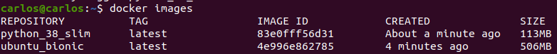

## Estudio sobre contenedores base de Docker Hub

---

En este estudio se pretende comprender cada uno de los motivos por los que se ha elegido el contenedor base para desarrollar el proyecto. Para ello inicialmente se han tenido en cuenta las dos opciones disponibles: el contenedor base "oficial" del lenguaje (*Python* en este caso) y los contenedores base oficiales de los principales sistemas operativos, siendo estos *Ubuntu*, *Alpine*, *CentOS*, *Debian* y *Fedora*.

### 1. Definir requisitos

Lo primero es definir aquellos requisitos a evaluar, que definan nuestro interés hacia un determinado contenedor base, para ello se tendrán en cuenta las principales versiones dentro de cada opción a valorar, se analizaran y se escogeran las más adecuadas.

Los requisitos principales a tener en cuenta son:
1. **Tamaño del contenedor base**: Importante ya que queremos optimizar nuestro contenedor, pero no es el único factor en el que fijarse, ya que existen otros factores que determinan la validez para nuestro proyecto. Si únicamente nos centraramos en el tamaño, lo más lógico sería escoger un contenedor base de *Alpine*, pero no es la intención.
2. **Librería [Libc6](https://packages.debian.org/stretch/libc6)**: Contiene las bibliotecas estándar de C y otras librerías estándar necesarias para muchas de las funcionalidades que necesita *Python3*. Puede instalarse perfectamente juntamente a sus dependencias, pero un contenedor base que lo tenga instalado por defecto será considerado de manera más positiva.
3. **Python3.8**: En nuestro proyecto necesitaremos la instalación de Python con versión 3.6+, por lo que obtener dicha instalación por defecto en el contenedor será un factor que se considerará positivo. Un exceso de bibliotecas instaladas que no se van a utilizar se considerará un factor negativo.
4. **Pip3**: Al trabajar con *Python3*, se necesita la gestión e instalación de paquetes *Pip* con la última versión del mismo, por lo que será necesaria su instalación.
5. **LTS**: Sería una solución ilógica desarrollar un proyecto en un sistema obsoleto o que dejará de tener soporte en breves, por lo que se tendrá en cuenta su fecha de finalización de soporte.

También se valorarán por otra parte, características como actualizaciones de seguridad, compatibilidad de bibliotecas, estabilidad y uso excesivo de bibliotecas, ya que queremos un sistema robusto y optimizado.

Además de los principales requisitos descritos, tras hacer una preselección, se seleccionarán aquellas opciones que se consideran mejores para evaluarlas con una instalación completa. Se analizarán en ese momento variables de entorno, usuarios y paquetes, entre otros aspectos.

### 2. Análisis opciones

A continuación se procede a analizar cada una de las opciones en base a los requisitos explicados anteriormente, para ello, se ha utilizado también la herramienta [container-diff](https://github.com/GoogleContainerTools/container-diff).

##### Ubuntu

Uno de los principales sistemas operativos, y uno de los más utilizados a la hora de diseñar un contenedor orientado a un desarrollo en *Python*

| Release | Size   | Libc6 | Python3.8      | Pip3 | LTS  | Comentarios                                                                       |
|---------|--------|-------|----------------|------|------|-----------------------------------------------------------------------------------|
| focal   | 72.9M  | Sí    | No             | No   | TBA  | Versión latest.                                                                   |
| bionic  | 62.4M  | Sí    | No             | No   | 2028 | Más usada en la actualidad. Más ligera con funcionalidad plena.                   |
| xenial  | 83.8M  | Sí    | No             | No   | 2024 | Existen opciones mejores y actualizadas.                                          |
| trusty  | 191.1M | Sí    | No, tiene 3.4  | No   | 2022 | Peor opción. Habría que desinstalar la versión de Python antigua e instalar nueva.|

Tras observar la tabla, podemos observar las diferentes opciones existentes para un contenedor base en *Ubuntu*, queda claro que las mejores opciones son las versiones *focal* y *bionic*, pero entrando en detalle, comparamos dichas versiones (la comparativa con la herramienta *container-diff* se puede ver [aquí](https://github.com/Carlosma7/MedAuth/blob/main/doc/estudio_docker/focal_vs_bionic.md)).

Tras observar, la única diferencia entre ambos sistemas, es la instalación y actualización de determinados paquetes. Si observamos los paquetes existentes en *focal*, podemos observar que son nuevas versiones de los paquetes de *bionic* o paquetes que no afectan al desempeño en nuestro proyecto.

Por otro lado, podemos observar que las versiones de *Libc6* son, respectivamente, *2.31-0ubuntu9.1* y *2.27-3ubuntu1.2*, las cuales soportan nuestra versión deseada de *Python* y poseen un tamaño similar.

Teniendo en cuenta todos estos factores, nos quedaremos como candidato para instalación de *Ubuntu* con **bionic**.

##### Alpine

Uno de los sistemas operativos más ligeros, del que destaca su enorme multitud de versiones, ya que anualmente se lanza una nueva versión del mismo, que será un factor a tener en cuenta de cara al futuro del proyecto.

| Release | Size | Libc6 | Python3.8 | Pip3 | LTS  | Comentarios                         |
|---------|-------|-------|----------|------|------|-------------------------------------|
| edge    | 5.4M  | No    | No       | No   | n/a  | Versión en desarrollo. Inestable.   |
| 3.12    | 5.3M  | No    | No       | No   | 2022 | Última versión estable.             |
| 3.11    | 5.4M  | No    | No       | No   | 2021 |                                     |
| 3.10    | 5.3M  | No    | No       | No   | 2021 |                                     |
| 3.9     | 5.3M  | No    | No       | No   | 2020 | Dejará de estar soportada este año. |

Tras evaluar las distintas opciones, y observar que apenas existen diferencias de cara a nuestro proyecto que sean relevantes, lo lógico sería pensar que es una excelente opción debido a su ligero tamaño y a que carece de bibliotecas instaladas por defecto, pero sin ir más lejos puede tratarse de una de las peores opciones si investigamos un poco.

Alpine no cabe duda que sería la mejor opción tratándose de un desarrollo sencillo y ligero en *Python*, pero si requerimos de algunas dependencias, esto puede ocasionar problemas debido a que *Alpine* no soporta los *wheels* estándar de Linux. *Alpine*, a diferencia de la mayoría de las distribuciones de Linux, utiliza *musl* en lugar de la versión estándar de la librería *glibc*. Por este motivo requeriríamos de compatibilizar *Alpine* con los *wheels* de *PyPI*.

Esta operación es realizable, pero nuevamente encontramos un problema, además de elevar considerablemente el tamaño del contenedor, la construcción del mismo es excesivamente lenta, tal y como se muestra en este [ejemplo](https://pythonspeed.com/articles/alpine-docker-python/) encontrado en [Pythonspeed](https://pythonspeed.com/), la construcción en comparación con una versión de *Ubuntu* es excesivamente lenta.

Cabría destacar como dato interesante que *Alpine* piensa incorporar en su versión *edge* algunas de las librerías más comunes, para poder realizar construcciones más rápidas, pero esto tampoco solucionaría el problema, ya que con el planteamiento de *Alpine* de ser un sistema ligero, no tendría sentido instalar todas las dependencias de *PyPI*.

Por estos motivos se descartan todas las opciones de *Alpine* de cara a ser considerado como contenedor base del contenedor del proyecto.

##### CentOS

*CentOS* es una distribución de **GNU/Linux Red Hat Enterprise Linux RHEL**. Es un sistema estable, de calidad y sobre todo *open source*. Inicialmente se destaca que es un sistema robusto, que utiliza sistema *rpm* y que posee por norma general un tamaño quizás elevado en comparación con otros sistemas operativos.

| Release | Size   | Libc6 | Python3.8                    | Pip3 | LTS  | Comentarios                                                               |
|---------|--------|-------|------------------------------|------|------|---------------------------------------------------------------------------|
| centos8 | 205.1M | No    | No, pero librerías de 3.6 sí | No   | 2029 | Versión latest.                                                           |
| centos7 | 201.3M | No    | No, Python 2.7               | No   | 2024 | Sería necesario desinstalar la versión de Python2.7 e instalar Python3.8. |
| centos6 | 197.5M | No    | No, Python 2.6               | No   | 2020 | Dejará de estar soportada este año.                                       |

Como se indicaba antes de realizar la tabla, las versiones de *CentOS* son considerablemente pesadas en comparación las versiones de otras opciones contempladas, además, cabe destacar que la última versión es la única que no posee alguna version de *Python* antigua, aunque sí posee bibliotecas relativas a *Python3.6*.

*CentOS* sería una opción considerable debido a la comodidad que supondría realizar la construcción de nuestro contenedor, lo sencillo que es su manejo y la enorme comunidad que posee detrás. Sin embargo, existen opciones considerablemente mejores, por lo que realizar una comparativa en la que se tenga en cuenta *CentOS* carece realmente de sentido.

##### Debian

*Debian* es el sistema operativo principal a la hora de utilizar un contenedor base, se debe a que es un sistema ligero, de software libre y que posee la funcionalidad básica de un sistema operativo. Más adelante se verá que la versión oficial de *Python* utiliza *Debian* como sistema operativo.

| Release      | Size   | Libc6 | Python3.8 | Pip3 | LTS  | Comentarios                                                           |
|--------------|--------|-------|-----------|------|------|-----------------------------------------------------------------------|
| buster       | 111.8M | Sí    | No        | No   | 2024 | Última versión estable.                                               |
| buster-slim  | 69.1M  | Sí    | No        | No   | 2024 | Contiene menos paquetes que la versión estándar. Funcionalidad básica.|
| 9            | 97.9M  | Sí    | No        | No   | 2022 | Sin actualizaciones de seguridad. El tag *stretch* no es válido.      |
| 9-slim       | 54.7M  | Sí    | No        | No   | 2022 | Sin actualizaciones de seguridad. El tag *stretch-slim* no es válido. |
| jessie       | 123.1M | Sí    | No        | No   | 2020 | Dejará de estar soportada este año.                                   |
| jessie-slim  | 77.6M  | Sí    | No        | No   | 2020 | Dejará de estar soportada este año.                                   |

Se han descartado las siguientes versiones:
* **bullseye**: Actual versión en desarrollo.
* **wheezy**: Obsoleta.
* Versiones **sid**: Versiones inestables.
* Versiones **backports**: Poseen tests de la siguiente versión en desarrollo.

Viendo la tabla queda claro que las versiones *jessie* quedan descartadas al dejar de estar soportadas en este mismo año, mientras que si se investiga un poco más, se puede ver que las versiones *9* (o *stretch*, el cual es el nombre que recibe dicha versión, pero no se emplea ya que el *tag* asociado no dirige a dicha versión) han dejado de tener actualizaciones de seguridad, por lo que teniendo en cuenta dichos factores, se descartan todas esas versiones.

Por otro lado, se puede observar que el caso de *buster* es bastante parecido al estudiado en *Ubuntu*, pero en este caso la versión es considerablemente más pesada. Sin embargo, existe la versión *buster-slim*, la cual es una versión más ligera ya que solo incluye las bibliotecas básicas para el funcionamiento del sistema operativo y se presenta como una de los principales candidatos de cara a ser el contendor base de nuestro contenedor, por lo que se evaluará posteriormente esta opción.

Teniendo en cuenta todos estos factores, nos quedaremos como candidato para instalación de *Debian* con **buster-slim**.

##### Fedora

Fedora es una distribución *GNU/Linux* que nace de *Red Hat Linux*. Al igual que *CentOS*, utiliza un sistema *rpm* y es considerablemente más pesado que otras opciones vistas como *Ubuntu* o *Debian*.

| Release | Size   | Libc6 | Python3.8      | Pip3 | LTS  | Comentarios                                                                                                          |
|---------|--------|-------|----------------|------|------|----------------------------------------------------------------------------------------------------------------------|
| 33      | 166.9M | No    | No, Python 3.9 | No   | 2022 | Última versión estable. Posee un Python superior al requerido, se necesita desinstalar e instalar la versión deseada.|
| 32      | 191.7M | No    | Sí             | No   | 2021 |                                                                                                                      |
| 31      | 168.9M | No    | No, Python 3.7 | No   | 2020 | Dejará de estar soportada este año.                                                                                  |

Tras un simple análisis, se puede observar que realmente se plantearía un debate entre las versiones *33* y *32*, ya que una es bastante más ligera, pero la otra posee integrada la versión deseada de *Python*.

Realmente no tiene mucho sentido plantearse la opción de utilizar *Fedora* existiendo opciones más ligeras, ya que en el contexto del proyecto *Fedora* no aporta ninguna ventaja relevante respecto a las otras opciones propuestas.

##### Python

El contenedor base "oficial" del lenguaje cuenta con una base *Debian* en la que se añaden los distintos paquetes y configuraciones para trabajar con dicho lenguaje. El estudio se centrará en las versiones que utilicen *Python3.8*, ya que utilizar versiones superiores carece de sentido ya que sería incompatible momentáneamente con el desarrollo del proyecto.

| Release    | Size   | Libc6 | Python3.8 | Pip3 | LTS  | Comentarios                                                     |
|------------|--------|-------|-----------|------|------|-----------------------------------------------------------------|
| 3.8-buster | 840M   | Sí    | Sí        | Sí   | 2024 | Demasiadas librerías innecesarias. Es la alternativa más pesada.|
| 3.8-slim   | 106.5M | Sí    | Sí        | Sí   | 2024 |                                                                 |
| 3.8-alpine | 40.1M  | No    | No        | Sí   | 2024 | Se descarta al tratarse de *Alpine*.                            |

Tal y como se explicaba en el apartado de *Alpine*, esta opción, pese a traer integrado *pip* queda descartada debido a su rendimiento y carencia de *wheels*. Por otro lado, la primera reacción al ver la versión *3.8-buster* es bastante mala ya que ocupa demasiado, pero se ha decidido crear un contenedor y comprobar que contiene realmente, para compararla con la versión *3.8-slim*.

Tras comprobar realmente que aportan cada una de las opciones, se ve que la opción más completa es evidentemente la *3.8-buster* y en ciertos casos sería una opción considerablemente buena, pero en este proyecto se pretende optimizar el contenedor, y obtener una base ligera y con la mayor funcionalidad, por lo que *3.8-slim*, que contiene los elementos más basicos de *Python3.8*, junto a *Pip3* es más que suficiente sin incluir bibliotecas extra que no van a ser utilizadas. Quedaría comprobar si esta instalación es realmente mejor que las seleccionadas previamente.

Teniendo en cuenta todos estos factores, nos quedaremos como candidato para instalación de *Python* con **3.8-slim**.

### 3. Preselección

| Release            | Size   | Libc6 | Python3.8 | Pip3 | LTS  | Comentarios                                |
|--------------------|--------|-------|-----------|------|------|--------------------------------------------|
| ubuntu:bionic      | 62.4M  | Sí    | No        | No   | 2028 | Opción más ligera.                         |
| debian:buster-slim | 69.1M  | Sí    | No        | No   | 2024 | Opción a priori menos destacada.           |
| python:3.8-slim    | 106.5M | Sí    | Sí        | Sí   | 2024 | Opción con Python3.8 integrada.            |

##### Variables de entorno

Aunque en el guión se comenta que uno de lo puntos a tener en cuenta es la observación de variables de entorno de los sistemas considerados, en nuestro problema es realmente carece de sentido ya que las opciones escogidas son relativamente similares y poseen las mismas variables de entorno. Si bien en *fedora* y *CentOS* podemos observar distintas variables, en *debian*, *ubuntu* y *python* (basado en *debian*), encontramos las mismas:

* LS_COLORS: Colores de la shell.
* HOSTNAME: Nombre del host.
* PWD: Directorio de trabajo actual.
* HOME: Directorio *home*
* TERM: Terminal de la shell, todos poseen **xterm**.
* SHLVL: Nivel de shell, todos poseen 1.
* PATH: ruta de ejecutables.

Sin embargo, cabe añadir que la opción de *Python* incluye algunas variables de entorno adicionales de configuraciones relativas a Python, las cuales pueden facilitar la configuración inicial:

* PYTHON_VERSION=3.8.6. Indica la versión de *Python* por defecto.
* PYTHON_PIP_VERSION=20.2.4. Indica la versión de *Pip* por defecto.
* PYTHON_GET_PIP_SHA256=6e0bb0a2c2533361d7f297ed547237caf1b7507f197835974c0dd7eba998c53c. Clave hash para acceso a *Pip* en la instalación.
* PYTHON_GET_PIP_URL=https://github.com/pypa/get-pip/raw/fa7dc83944936bf09a0e4cb5d5ec852c0d256599/get-pip.py. URL de descarga de *Pip*.

* LANG=C.UTF-8. Lenguaje de interpretación. C de computer, UTF-8 de codificación.
* GPG_KEY=E3FF2839C048B25C084DEBE9B26995E310250568. GNU Privacy Guard key.

Tras observar estas diferencias, lo único que podemos observar es que la opción de *Python* de momento es preferible ya que demuestra una correcta instalación de los componentes necesarios para el proyecto de forma natural.

##### Usuarios

A continuación se observan los diferentes usuarios, y nuevamente nos encontramos con una situación similar a la anteriormente planteada con las variables de entorno, ya que las tres opciones poseen los mismos usuarios:

* root
* daemon
* bin
* sys
* sync
* games
* man
* lp
* mail
* news
* uucp
* proxy
* www-data
* backup
* list
* irc
* gnats
* nobody
* _apt

Realmente este aportado no nos aporta ninguna ventaja, además, por cuestiones de seguridad e integridad del proyecto, se diseñará un usuario específico para el propósito, por lo que los usuarios disponibles carecen aún más de sentido en cuanto a esta comparativa.


##### Paquetes

Haciendo uso de nuevo de la herramienta [container-diff](https://github.com/GoogleContainerTools/container-diff), se procede a examinar los paquetes de las distintas bases preseleccionadas, en las que podemos encontrar principalmente los mismos paquetes, algunos con diferentes versiones, que no afectan en absoluto al desempeño de nuestro proyecto.

Inicialmente realizamos una comparativa entre **ubuntu:bionic** y **debian:buster-slim**.

Packages found only in **ubuntu:bionic**

| NAME            | VERSION              | SIZE |
|-----------------|----------------------|------|
| -bzip2          | 1.0.6-8.1ubuntu0.2   | 177K |
| -libncurses5    | 6.1-1ubuntu1.18.04   | 283K |
| -libncursesw5   | 6.1-1ubuntu1.18.04   | 343K |
| -libprocps6     | 2:3.3.12-3ubuntu1.2  | 118K |
| -libtinfo5      | 6.1-1ubuntu1.18.04   | 497K |
| -lsb-base       | 9.20170808ubuntu1    | 58K  |
| -procps         | 2:3.3.12-3ubuntu1.2  | 709K |
| -sensible-utils | 0.0.12               | 62K  |
| -ubuntu-keyring | 2018.09.18.1~18.04.0 | 46K  |

Packages found only in **debian:buster-slim**

| NAME                          | VERSION                      | SIZE |
|-------------------------------|------------------------------|------|
| -debian-archive-keyring       | 2019.1                       | 198K |
| -libncursesw6                 | 6.1 20181013-2+deb10u2       | 411K |
| -libtinfo6                    | 6.1 20181013-2+deb10u2       | 521K |
| -tzdata                       | 2020a-0 deb10u1              | 3M   |

Como podemos observar, las diferencias consisten en distintos paquetes de herramientas y configuraciones de cada sistema, por lo que realmente se encuentran ambos en una situación similar en esta comparativa, teniendo en cuenta que la opción de **debian:buster-slim** utiliza paquetes con versiones más actualizadas, por lo que se decanta como mejor opción, ya que la diferencia de tamaño entre imágenes es despreciable en este caso, e interesaría poseer un sistema más actualizado.

A continuación, lo comparamos con **python:3.8-slim**, el cual de antemano se razona que tendrá más paquetes debido a que se trata de una instalación del mismo sistema operativo con configuración de *Python*:


Packages found only in **python:3.8-slim**

| NAME                   | VERSION                | SIZE |
|------------------------|------------------------|------|
| -ca-certificates       | 20200601~deb10u1       | 381K |
| -libexpat1             | 2.2.6-2 deb10u1        | 519K |
| -libgdbm6              | 1.18.1-4               | 117K |
| -libreadline7          | 7.0-5                  | 416K |
| -libsqlite3-0          | 3.27.2-3               | 1.3M |
| -libssl1.1             | 1.1.1d-0 deb10u3       | 4M   |
| -netbase               | 5.6                    | 44K  |
| -openssl               | 1.1.1d-0 deb10u3       | 1.4M |
| -readline-common       | 7.0-5                  | 89K  |

Tal y como se esperaba, la base de **python:3.8-slim** posee todos los paquetes de **debian:buster-slim** y además incluye paquetes o bibliotecas que pertenecen a *Python* o que se utilizan para su instalación, tal y como se puede observar en el *Dockerfile* del contenedor en [DockerHub](https://github.com/docker-library/python/blob/master/3.7/windows/windowsservercore-ltsc2016/Dockerfile).

Tras observar las tres opciones con mayor detenimiento, el debate que se plantea es bastante sencillo: ¿Realizando una instalación lo más liviana posible de *Python3.8* y *Pip3* en los contenedores de *ubuntu:bionic* y *debian:buster-slim* se puede alcanzar un tamaño inferior al del contenedor base oficial del lenguaje? Cabe indicar que el contenedor base **python:3.8-slim** no solo está basado en **debian:buster-slim**, sino que además dicha configuración está optimizada, por lo que realmente la conclusión a la que se llega es que la única opción que se puede llegar a equiparar es la de **ubuntu:bionic** con una instalación minimal de *Python*.

Aunque en un principio cabe esperar, a continuación se realizará la creación de dicho contenedor en **ubuntu:bionic** y se examinará el tamaño respecto a **python:3.8-slim** para poder tomar una decisión final.

### 4. Elección final

Tras realizar las comparativas previas y seleccionar **ubuntu:bionic** y **python:3.8-slim** como opciones principales a comprobar, se ha optado por realizar dos imágenes sencillas, que contengan una instalación simple de *Python3.8* y *Pip3* como requesitos, por lo que se han creado los siguientes *Dockerfiles* de forma simple para comprobar el tamaño que se obtiene al hacer una construcción simple de una imagen:

**ubuntu:bionic**

```dockerfile
FROM ubuntu:bionic

# Se realizan las instalaciones de Python y Pip
RUN apt-get update \								# Update apt packages
  && apt-get install -y python3-pip python3-dev \	# Install Python3 and Pip3
  && cd /usr/local/bin \
  && ln -sf /usr/bin/python3 python \				# Link Python to Python3 version
  && python -m pip install --upgrade pip \			# Upgrade Pip
  && useradd -ms /bin/bash medauth					# Add user MedAuth for security

USER medauth	# Set MedAuth user as default

WORKDIR /home/medauth	# Change work directory to MedAuth's home directory

CMD /bin/bash
```

**python:3.8-slim**

```dockerfile
FROM python:3.8-slim

RUN useradd -ms /bin/bash medauth	# Add user MedAuth for security

USER medauth	# Set MedAuth user as default

WORKDIR /home/medauth	# Change work directory to MedAuth's home directory

CMD /bin/bash
```

Como se puede observar, los ejemplos de *Dockerfiles* son muy sencillos para el proyecto e insuficientes en cuanto a dependencias, pero permiten comprobar tras crear ambas imágenes, las diferencias entre las mismas. A continuación se muestra la información sobre las imágenes creadas:



Como se puede observar, en dos construcciones simples de dos imágenes, la imagen de **ubuntu:bionic** es cinco veces mayor que la imagen de **python:3.8-slim**. Esto se debe a que la instalación estándar de *Python3*, pese a ser simple, contiene muchas librerías y no está optimizada. Podría plantearse realizar una optimización exhaustiva en la imagen de **ubuntu::bionic**, pero no nos garantizaría obtener el mismo o mejor resultado, y conllevaría demasiado esfuerzo y tiempo disponiendo de una opción evidentemente mejor, no solo por el tamaño, sino porque al traer integradas las herramientas e instaladas de forma optimizada, cumple con los requisitos ideales para nuestro contenedor base.

En base a todo este estudio, finalmente se decide utilizar **python:3.8-slim** como contenedor base del futuro contenedor del proyecto.
