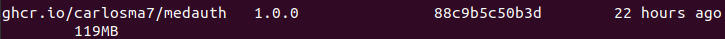

## GitHub Container Registry

---

### Subida contenedor a GitHub Container Registry

Una de los registros alternativos que se presentan como alternativa a [Docker Hub](https://hub.docker.com/) es la propuesta que presenta *GitHub* con su nuevo registro [GitHub Container Registry](https://github.blog/2020-09-01-introducing-github-container-registry/). Este surge como una evolución natural de la herramienta [GitHub Packages Registry](https://github.com/features/packages). De hecho, consiste en una versión beta de la herramienta y está actualmente sujeta a cambios que se realicen en la misma.

Para poder gestionar este registro, se han seguido los siguientes pasos:

1. Generar un ```Personal access tokens```:


2. Se loguea con ```docker``` en *GitHub Container Registry*, utilizando el *PAT* generado previamente (se muestra con una variable de entorno de forma que quede oculta por seguridad del proyecto).


3. Creamos el *tag* con la orden ```docker tag <ID_IMAGEN> ghcr.io/carlosma7/medauth:1.0.0```.



4. Antes de realizar el *push*, hay que habilitar el *soporte mejorado de contenedores*, para ello, se selecciona en la esquina superior derecha nuestro perfil, y se selecciona la opción **Feature preview**. Una vez dentro, se presiona en **Enable**.


5. Se realiza el *push* de la imagen a *GitHub*.


6. Una vez que ha finalizado, en el perfil de *GitHub*, en la sección *Packages* se puede observar que se ha creado el contenedor.


7. Se puede observar que se indica que se conecte el repositorio al contenedor, para ello, más abajo se puede observar la instrucción necesaria para unir el repositorio mediante el *Dockerfile*.


8. Una vez actualizado el *Dockerfile*, se puede ver que se ha conectado correctamente al repositorio. A continuación se observa el resultado final:


9. Para hacerlo visible, hay que entrar en la opción *Package Settings* y seleccionar la opción **Make Public**.

 

10. Por último, desde el repositorio, a la derecha se puede observar que el contenedor queda claramente reflejado en la sección *Packages*:


### Actualización automática

Para la actualización automática del contenedor con el repositorio de *GitHub*, se ha diseñado una **GitHub Action** que controle el evento de realización de un *push* al repositorio. Para ello se ha utilizado como base de desarrollo la *Action* **Publish Docker Container** que pertenece al conjunto *starter-workflows* del propio *GitHub*.


A continuación se muestra la *GitHub Action* definida como ```GitHub-Container-Registry```:

```yaml
name: GitHub-Container-Registry

# When is activated
on:
  # When pushing to the repository
  push:
    # Only considers "main" branch
    branches:
      - main

    # Publish "v1.2.3" tags as releases
    tags:
      - v*

# Jobs to do
jobs:
  # Push of the docker image
  push:
    # Detect on ubuntu the "push" event
    runs-on: ubuntu-latest
    if: github.event_name == 'push'

    # Steps of the job
    steps:
      # Checks-out repository under $GITHUB_WORKSPACE, so workflow can access it
      - uses: actions/checkout@v2

      # Build the image in local space
      - name: Build image
        run: docker build -t medauth .

      # Log into Github Container using secrets
      - name: Log into GitHub Container Registry
        run: echo "${{ secrets.PAT }}" | docker login ghcr.io -u Carlosma7 --password-stdin

      # Push the image to the repository
      - name: Push image
        run: |
          # Image on Github Container Registry
          IMAGE_ID=ghcr.io/carlosma7/medauth
          # Strip git ref prefix from version
          VERSION=$(echo "${{ github.ref }}" | sed -e 's,.*/\(.*\),\1,')
          # Strip "v" prefix from tag name
          [[ "${{ github.ref }}" == "refs/tags/"* ]] && VERSION=$(echo $VERSION | sed -e 's/^v//')
          # Use Docker `latest` tag convention
          [ "$VERSION" == "main" ] && VERSION=latest
          echo IMAGE_ID=$IMAGE_ID
          echo VERSION=$VERSION
          # Tag of the image
          docker tag medauth $IMAGE_ID:$VERSION
          # Push the image
          docker push $IMAGE_ID:$VERSION
```

Para la realización se han utilizado algunas [variables de entorno de GitHub](https://docs.github.com/es/free-pro-team@latest/actions/reference/environment-variables) y también se ha utilizado para almacenar el *PAT* un [secret](https://docs.github.com/es/free-pro-team@latest/actions/reference/encrypted-secrets).


A continuación, tras realizar un commit, se puede observar que se lanza la ejecución pertinente de la *GitHub Action* y funciona correctamente (tras unos ajustes).


Por último, se comprueba que realmente se ha actualizado el contenedor:


