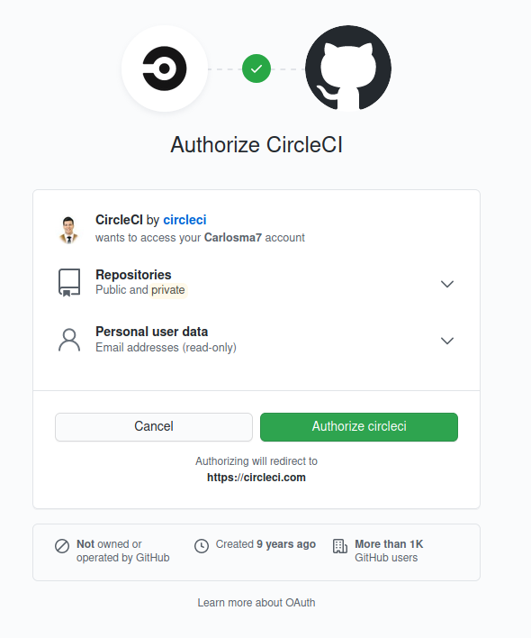
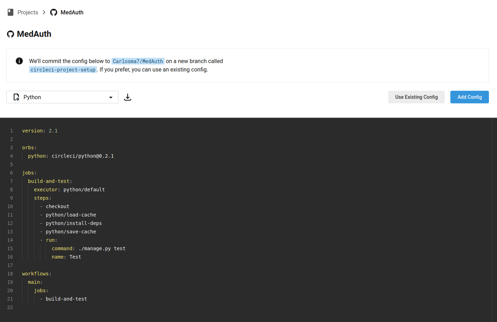
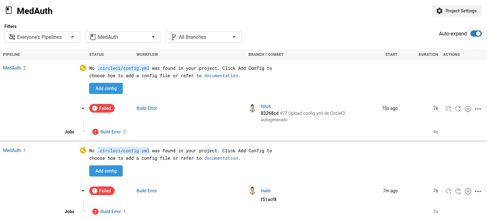
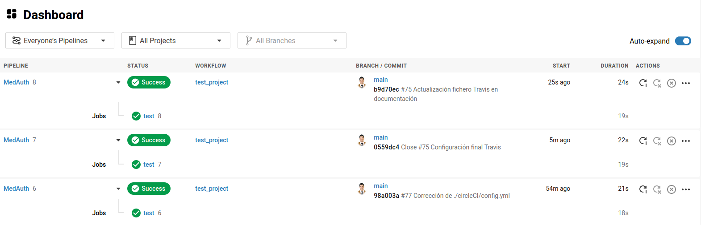

## CircleCI

### Configuración CircleCI

[](https://github.com/Carlosma7/MedAuth)

Para poder configurar CircleCI, se deben seguir los siguientes pasos:

1. Darse de alta.



2. A continuación, nos pide que indiquemos la organización, por lo que tomaremos la única opción en este caso.


3. Una vez configurado, nos dirigiremos a *CircleCI*, y podemos observar la pantalla inicial. En esta vemos una lista con los repositorios disponibles, y seleccionamos el botón ```Set Up Project```.


4. Se nos muestra una configuración estándar basada en el lenguaje de nuestro proyecto (si únicamente poseemos uno es capaz de detectarlo). En este caso producía error al añadir la configuración, por lo que copiamos el código y seleccionamos ```Use Existing Config```.



5. Una prueba de que no está bien configurado es que si no se copia el fichero de configuración **config.yml** en la carpeta correpondiente, *CircleCI* no es capaz de detectarlo. Sin embargo vemos que con cada *push* que se realiza *CircleCI* hace la comprobación e indica que no detecta el fichero de configuración en la carpeta **.circleci**.



6. A continuación introducimos el ejemplo propuesto anteriormente en la carpeta indicada dentro de la raíz del proyecto: **.circleci/config.yml**:


7. El fichero de configuración es un esquema estándar, y como tal no cumple con los requisitos de nuestro proyecto, por lo que para ello hay que definir correctamente el fichero **config.yml**, y una vez realizada la configuración, se puede observar que funciona correctamente:


