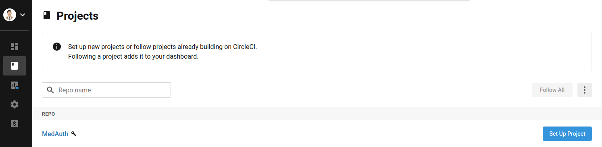
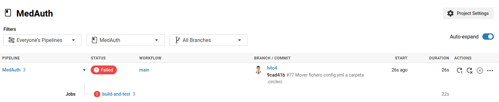

## CircleCI

### Configuración CircleCI

[](https://app.circleci.com/pipelines/github/Carlosma7/MedAuth)

Para poder configurar CircleCI, se deben seguir los siguientes pasos:

1. Darse de alta.


2. A continuación, nos pide que indiquemos la organización, por lo que tomaremos la única opción en este caso.


3. Una vez configurado, nos dirigiremos a *CircleCI*, y podemos observar la pantalla inicial. En esta vemos una lista con los repositorios disponibles, y seleccionamos el botón ```Set Up Project```.



4. Se nos muestra una configuración estándar basada en el lenguaje de nuestro proyecto (si únicamente poseemos uno es capaz de detectarlo). En este caso producía error al añadir la configuración, por lo que copiamos el código y seleccionamos ```Use Existing Config```.


5. Una prueba de que no está bien configurado es que si no se copia el fichero de configuración **config.yml** en la carpeta correpondiente, *CircleCI* no es capaz de detectarlo. Sin embargo vemos que con cada *push* que se realiza *CircleCI* hace la comprobación e indica que no detecta el fichero de configuración en la carpeta **.circleci**.


6. A continuación introducimos el ejemplo propuesto anteriormente en la carpeta indicada dentro de la raíz del proyecto: **.circleci/config.yml**:



7. El fichero de configuración es un esquema estándar, y como tal no cumple con los requisitos de nuestro proyecto, por lo que para ello hay que definir correctamente el fichero **config.yml**, y una vez realizada la configuración, se puede observar que funciona correctamente:


### Configuración config.yml

Se puede ver el fichero **config.yml** [aquí](https://github.com/Carlosma7/MedAuth/blob/main/.circleci/config.yml).

Cada vez que se realiza un *push*, *CircleCI* mediante *triggers* automatiza el proceso de ejecución de *builds*, usando para ello el fichero de configuración definido en nuestro repositorio, denominado ```config.yml```. Este fichero contiene los *pipelines* que permiten la ejecución del *build* y las diferentes características de dicho build, mediante *YAML*.

En el proyecto, hay que tener en cuenta los siguientes requisitos de cara a la configuración del fichero *config.yml*:

* El lenguaje debe ser Python3.8, pero se debe comprobar también con versiones inferiores como la 3.6 o 3.7.
* Se deben tener en cuenta las dependencias del proyecto que hacen que este funcione como biblioteca de aserciones, gestor de tareas o marco de pruebas.
* Ejecución de tests, empleando para ello el gestor de tareas previamente configurado.

Para ello se utiliza una imagen de *Docker* oficial de *CircleCI*, que se puede observar [aquí](https://hub.docker.com/r/circleci/python). Esta imagen no servirá de entorno donde ejecutar los tests.

```yaml
---
version: 2.1

# Tasks definition
jobs:
    test:
        docker:
            # CircleCI official docker image with the project version
            - image: circleci/python:3.8-buster
        steps:
            - checkout
            # Install dependencies (Invoke, Pytest, and Assertpy)
            - run: pip3 install -r requirements.txt
            # Launch tests using the task manager
            - run: invoke test

# Workflows of CircleCI
workflows:
    test_project:
        jobs:
            - test
```

### Configuración config.yml con contenedor Docker del proyecto

Una de las mejoras es la de aprovechar el propio entorno de pruebas que se crea con el contenedor del proyecto, ya que no será necesario instalar nada, y tenemos el entorno ideal para realizar la comprobación del proyecto. Para ello se aprovecha las características de *CircleCI*, indicando como contenedor sobre el que trabajar el propio del proyecto en [Docker Hub](https://hub.docker.com/repository/docker/carlosma7/medauth).

```yaml
---
version: 2.1

# Tasks definition
jobs:
    test:
        docker:
            # Project's Docker image in Docker Hub
            - image: carlosma7/medauth:latest
        steps:
            - checkout
            # Launch tests using the task manager
            - run: invoke test

# Workflows of CircleCI
workflows:
    test_project:
        jobs:
            - test
```
