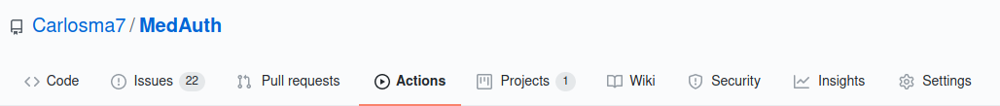
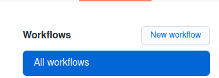
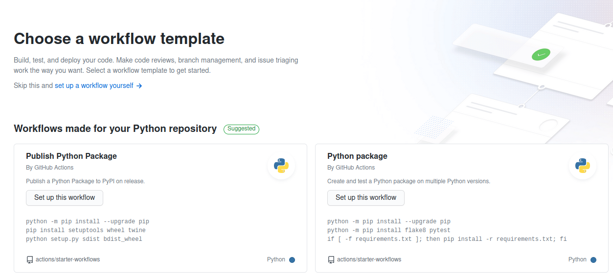
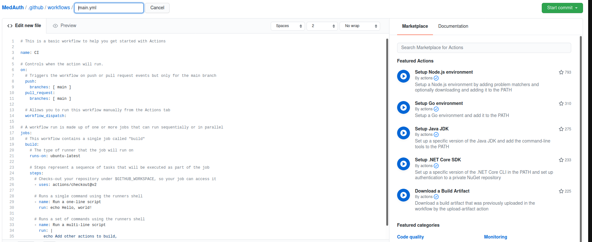

## GitHub Actions

### Configuración GitHub Action

[](https://github.com/Carlosma7/MedAuth/actions?query=workflow%3AGitHub-Actions-CI)

Las [GitHub Actions](https://github.com/features/actions) son una serie de ficheros de configuración para la automatización de tareas y flujos de trabajo de nuestro repositorio de *GitHub*. Estas ayudan a automatizar tareas dentro del ciclo de vida del desarrollo de software. 

Están controladas por eventos, lo que significa que puede ejecutar una serie de comandos después de que haya ocurrido un evento específico. Por ejemplo, si queremos que se realicen una serie de acciones tras realizar un *push*.

Para configurar una *Action*, dentro de nuestro repositorio, nos dirigiremos al apartado ```Actions```:



Una vez estamos en el apartado, seleccionaremos el botón ```New workflow``` para definir una nueva action:



A continuación se nos muestra una pantalla de *templates* existentes sobre las que basar nuestra *Action*, o la opción de realizarla manualmente:



Se nos muestra a continuación un editor con un esquema estándar para *CI*, y al finalizar la configuración, basta con presionar el botón ```Start commit``` para realizar guardar y activar dicha *Action*:



Otra alternativa, es realizar en local el diseño y configuración de la *Action*, y guardarla en la carpeta destinada a las *Actions*, la cual es ```./github/workflows/action.yml```.

### Configuración github_actions_CI.yml

Se puede ver el fichero **.github_actions_CI.yml** [aquí](https://github.com/Carlosma7/MedAuth/blob/main/.github/workflows/github_actions_CI.yml).

La *GitHub Action* definida consiste en dos partes principales:

* Definición del *trigger*: Debe activarse solo sobre la rama *main* al hacer un *push* a esta.
* Definición de las tareas: 
    * Permitir acceso del workflow al espacio de trabajo del repositorio
    * Construir la imagen asociada al repositorio.


```yaml
name: GitHub-Actions-CI

# When is activated
on:
  # When pushing to the repository
  push:
    # Only considers "main" branch
    branches:
      - main

    # Publish "v1.2.3" tags as releases
    tags:
      - v*

# Jobs to do
jobs:
  # Push of the docker image
  push:
    # Detect on ubuntu the "push" event
    runs-on: ubuntu-latest
    if: github.event_name == 'push'

    # Steps of the job
    steps:
      # Checks-out repository under $GITHUB_WORKSPACE, so workflow can access it
      - uses: actions/checkout@v2

      # Build the image in local space
      - name: Build image
        run: docker build -t medauth .
```
