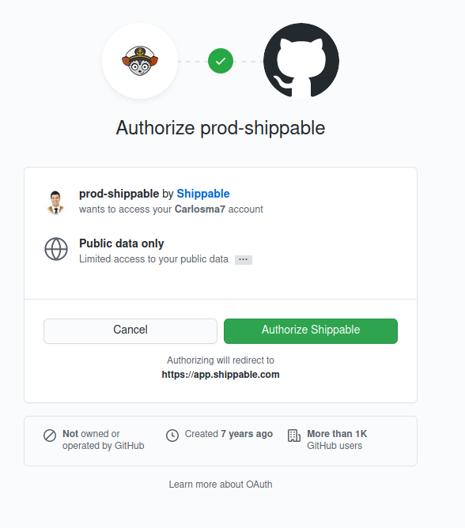
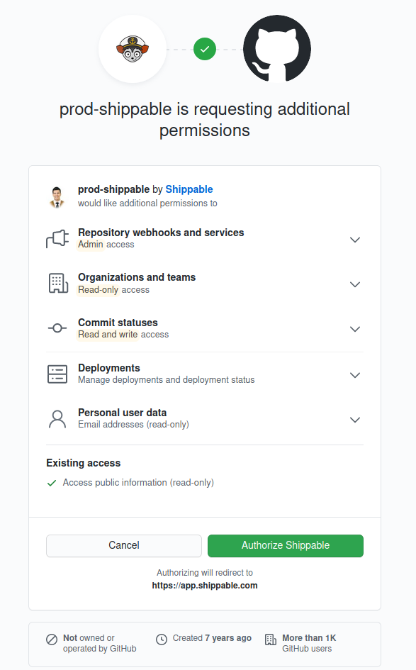
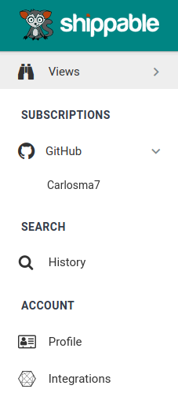
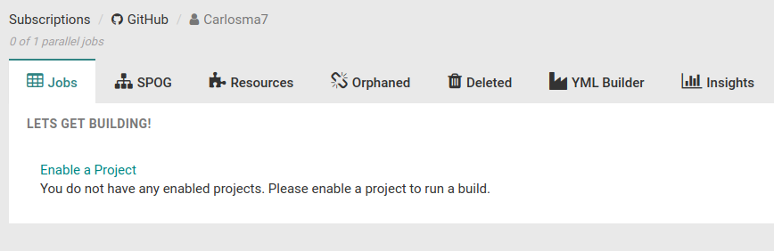
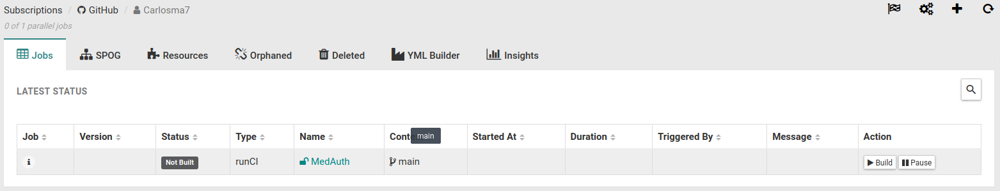
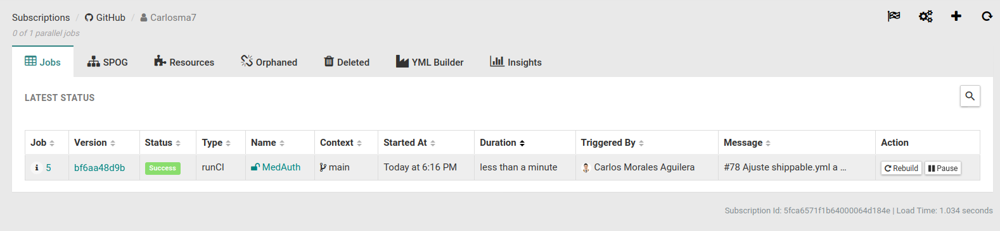

## Shippable

### Configuración Shippable

[](https://app.shippable.com/github/Carlosma7/MedAuth/dashboard/jobs)

Para poder configurar Shippable, se deben seguir los siguientes pasos:

1. Darse de alta.

	
	
2. A continuación, aceptaremos los permisos solicitados por la aplicación de *Shippable*.

	

3. Para poder activar la integración continua en el proyecto hay que dirigirse a la plataforma de *Shippable*, y una vez dentro seleccionar en el menú lateral izquierdo el botón ```GitHub```, y posteriormente el botón de nuestro usuario, en este caso ```Carlosma7```:

	

4. Se nos muestra la pantalla de proyectos, seleccionaremos el botón ```Enable a project```.

	

5. Se muestra una lista de los repositorios, donde activaremos nuestro proyecto:

	

6. Dirigiéndonos de nuevo a la sección de proyectos, podemos observar que se ha configurado correctamente el proyecto, y está a la espera de la realización de un primer *push*. Aquí se configurará el fichero **shippable.yml** para que se realice la *CI* en los *push* que se realicen en el proyecto.

	

7. Tras añadir la configuración correcta del fichero **shippable.yml**, se puede observar que finalmente *Shippable* realiza correctamente la integración continua:

	
	
### Configuración shippable.yml

Se puede ver el fichero **shippable** [aquí](https://github.com/Carlosma7/MedAuth/blob/main/shippable.yml).

Cada vez que se realiza un *push*, *Shippable* mediante *triggers* automatiza el proceso de ejecución de *builds*, usando para ello el fichero de configuración definido en nuestro repositorio, denominado ```shippable.yml```. Este fichero contiene los *pipelines* que permiten la ejecución del *build* y las diferentes características de dicho build, mediante *YAML*.

En el proyecto, hay que tener en cuenta los siguientes requisitos de cara a la configuración del fichero *.travis.yml*:

* El lenguaje debe ser Python3.8, pero se debe comprobar también con versiones inferiores como la 3.6 o 3.7. :warning:
* Se deben tener en cuenta las dependencias del proyecto que hacen que este funcione como biblioteca de aserciones, gestor de tareas o marco de pruebas.
* Ejecución de tests, empleando para ello el gestor de tareas previamente configurado.

:warning: En el caso de *Shippable*, durante el proceso de configuración de las diferentes versiones, se han encontrado problemas para la configuración de las versiones de *Python* 3.6 y 3.8. Esto se debe a que la versión 3.8 actualmente no está disponible tal y como se puede observar en la [lista de versiones](http://docs.shippable.com/platform/runtime/machine-image/language-versions/#python) que contempla *Shippable* para *Python*. Por otro lado la configuración de la versión 3.6 conlleva una configuración previa del entorno de trabajo del proyecto, por lo que se descarta ya que el proyecto al ser desarrollado en *Python3.8* debe ser compatible con las versiones 3.6 y 3.7, por lo que únicamente se comprueba con 3.7.

```yaml
---
# Language Python with versions 3.6, 3.7 and 3.8
language: python
python:
  - 3.7

build:
  ci:
    # Install dependencies (Invoke, Pytest and Assertpy)
    - pip3 install -r requirements.txt
    # Launch tests using the task manager
    - invoke tests
```
