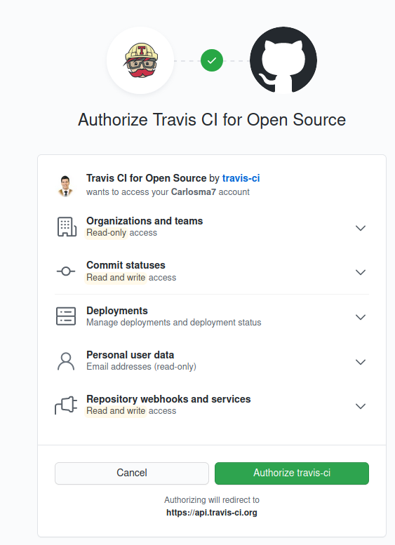
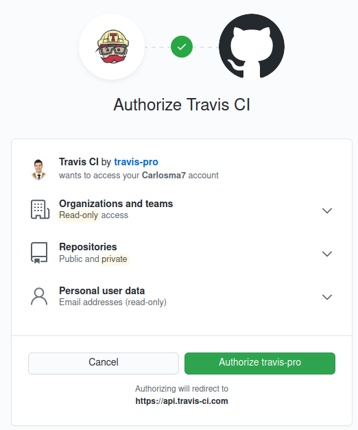
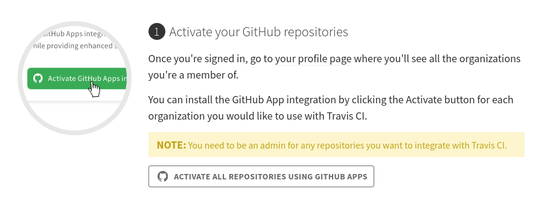
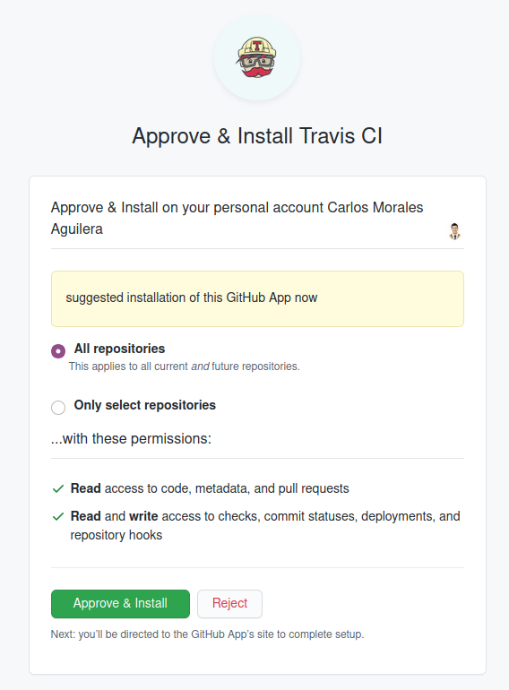
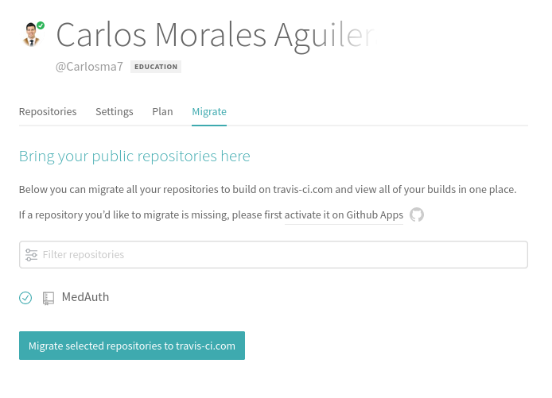
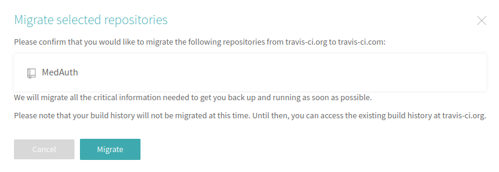
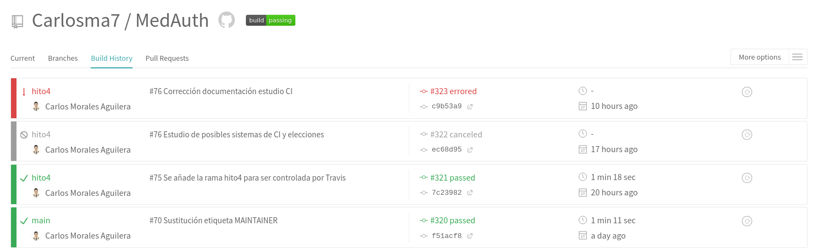

## TravisCI

### Configuración Travis 

[](https://travis-ci.com/Carlosma7/MedAuth)

Para poder configurar Travis, se deben seguir los siguientes pasos:

1. Darse de alta. (En mi caso lo hice al inicio del proyecto como se pedía en los ejercicios, pero por desconocimiento lo realicé en **Travis-ci.org**, por lo que posteriormente habrá que migrar a **Travis-ci.com**).

	

2. Activar el repositorio en el que se vaya a aplicar la integración continua. (El repositorio actualmente se llama *MedAuth*, pero cuando se realizó el procedimiento se llamaba *CC-MedAuth*, aunque esto no afecta a la configuración).

	

3. Tal y como se puede leer en este [newsletter de Travis](https://mailchi.mp/3d439eeb1098/travis-ciorg-is-moving-to-travis-cicom), *Travis-ci.org* va a ser apagado el 31 de diciembre de este año, y se trabajará únicamente con *Travis-ci.com*, por lo que para ello hay que dirigirse a dicha plataforma, y al igual que en el primer paso, registrarse con *GitHub*:

	

4. Una vez ya está dado de alta, se procede a conectar Travis a nuestro perfile de *GitHub*, para ello en la pantalla inicial de *Travis* (a partir de este punto nos referiremos siempre a *Travis-ci.com* como *Travis*) seleccionaremos la opción ```Activate all repositories using GitHub App```:

	

5. Dar permiso e installar:

	

6. A continuación se visualizan los repositorios en *Travis*, menos el repositorio del proyecto, ya que esté no ha sido migrado, para ello nos dirigiremos a nuestro Perfil -> *Settings*, y una vez allí nos dirigiremos a la pestaña ```Migrate```. Una vez allí seleccionaremos el repositorio y seleccionaremos en ```Migrate selected repositories to travis-ci.com```:

	

7. Confirmamos seleccionando ```Migrate```.

	
	
8. Podemos observar que se ha configurado correctamente ya que se pueden observar todos los *builds* previos:

	
