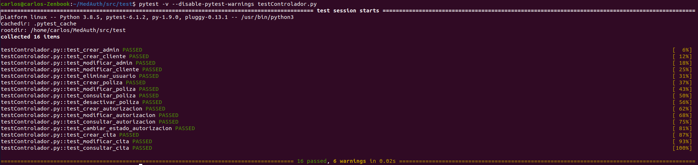

## Marco de pruebas

---

El marco de pruebas escogido es [pytest](https://docs.pytest.org/en/stable/).

Para la elección de un marco de prueba apropiado, se han valorado como principales herramientas posibles [unittest(PyUnit)](https://docs.python.org/3/library/unittest.html) y [pytest](https://docs.pytest.org/en/stable/), ya que *unittest* se integra como biblioteca estándar de Python y *pytest* es la biblioteca más usada actualmente por sus funcionalidades.

Se ha optado finalmente por utilizar *pytest* frente a *unittest* por lo siguientes motivos:

* Puede ejecutar test de *unittest*, aunque actualmente no se consideren, podrían plantearse sin problemas en un futuro o incluso realizar el cambio sin ningún tipo de problema.
* Visualización óptima de errores, no se limita a mostrar la línea del error como *unittest* sino que *pytest* además indica el error, los valores y remarca con colores.
* Utiliza la sentencia **assert** estándar en Python.
* Permite parametrización de los tests con diferentes parámetros.
* Permite un setup de test con enfoques o *fixtures* de módulo, sesión o función.
* La ejecución de tests permite selección de tests por nombre al marcar correctamente su *fixture*.
* En *pytest* los tests se definen como funciones, a diferencia de *unittest* que requiere de una clase con herencia, y cuyos métodos representan los tests.
* Al no pertenecer a la librería estándar de Python, no depende de las releases del mismo.

Un ejemplo de ejecución de *pytest* se puede ver con la ejecución del [test de controlador](https://github.com/Carlosma7/MedAuth/blob/main/src/test/testControlador.py):

